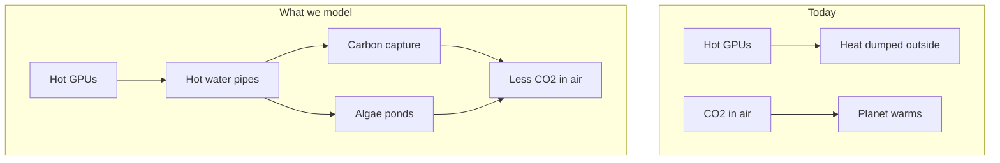

<p align="center">
  <strong>Data Center Heater Side Gig</strong><br>
  <em>Job 1: cool the GPUs. Side gig: pull CO₂ from the air.</em>
</p>

<p align="center">
  <a href="#start-here">Start here</a> ·
  <a href="#the-big-idea">Big idea</a> ·
  <a href="#what-we-found-nvidia-us">NVIDIA results</a> ·
  <a href="#how-the-simulation-works">Methods</a> ·
  <a href="#try-it-yourself">Run it</a> ·
  <a href="#glossary">Glossary</a>
</p>

<p align="center">
  
  
  
  
  
</p>

---

## Start here

> **In one sentence:** Data centers are giant heaters. What if that heat had a **side gig** — removing CO₂ from the atmosphere instead of only warming the planet?

Companies like **NVIDIA** are building huge **data centers** full of powerful **GPUs** (the chips that train AI). Those chips get **hot**. Cooling them produces **waste heat** — the data center’s unwanted “heater” output. Today, most of that heat is thrown away.

**Data Center Heater Side Gig** is a **computer simulation** of a smarter second job for that heat:

1. Capture the hot water cooling the GPUs.
2. Use that heat to run **carbon capture** machines and **algae ponds**.
3. Measure how much CO₂ is removed — and whether it actually helps the climate after you pay for electricity.

You do **not** need to be an engineer to understand the results. Read [The big idea](#the-big-idea) first, then [What we found](#what-we-found-nvidia-us).

---

## The big idea

### The problem (explained simply)

| What happens today | Why it matters |
|--------------------|----------------|
| GPUs crunch numbers for AI | They use a lot of electricity |
| Almost all that electricity becomes **heat** | Heat has to go somewhere |
| Data centers **cool** the chips with water or air | Then dump the heat outside |
| That heat is **waste** | It does not help anyone |

At the same time, Earth has **too much CO₂** in the atmosphere from burning fossil fuels. CO₂ acts like a blanket and traps heat — that is the main driver of **global warming**.

### The idea we simulate



**Carbon capture (DAC)** — Special materials suck CO₂ out of the air. They need **heat** to “release” and store that CO₂. GPU waste heat can help power that process (often through a **heat pump** that warms the heat up even more).

**Algae ponds** — Tiny plants in water use sunlight to grow. As they grow, they pull CO₂ from the air (same idea as trees, but faster in the right conditions). They grow best at a **steady, warm temperature** — which waste heat can help maintain.

A **robotic controller** in our simulation decides *where* to send the heat: carbon capture, algae, storage, or emergency cooling — similar to how a smart thermostat picks where warmth should go.

---

## What we found (NVIDIA U.S.)

We ran the simulator with settings meant to resemble **one new U.S. AI data-center hall** — the kind of building NVIDIA and partners are expanding across the American Southwest (Arizona, Nevada, Texas).

### What one building represents

| Setting | Plain English | Simulated value |
|---------|---------------|-----------------|
| **Building size** | One large liquid-cooled GPU hall | ~**50 megawatts** of waste heat on average |
| **Busy hours** | When AI training jobs peak | Up to **72 MW** |
| **Location** | Hot, sunny U.S. Southwest | ~17–32 °C outside |
| **Carbon capture plant** | Factory that pulls CO₂ from air | **12 MW** of heat-powered regeneration |
| **Algae farm** | Ponds that grow algae for CO₂ uptake | **2.5 hectares** (~5 football fields of surface) |
| **Time modeled** | How long we ran the math | **30 days**, then scaled to **1 year** |

### Headline results (DAC-focused campus)

When the system **prioritizes carbon capture** (most realistic if the goal is maximum CO₂ removed):

| Result | 30 days | If this kept up for a year |
|--------|---------|----------------------------|
| CO₂ captured from air (DAC) | **5,655 tonnes** | ~68,800 tonnes |
| CO₂ fixed by algae | 0 tonnes* | — |
| Electricity used by heat pumps | costs **1,053 tonnes CO₂e** | ~12,800 tonnes |
| **Net CO₂ removed** | **4,602 tonnes** | **~56,000 tonnes / year** |
| GPU cooling safety | **0 seconds** over safe limit | Safe |

\* *In this run the controller stayed on carbon capture the whole time. Algae needs its own heat connection time — see [balanced run](#balanced-dac--algae) below.*

#### Put 56,000 tonnes in perspective

| Comparison | Size |
|------------|------|
| Average car emissions (U.S.) | ~4.6 tonnes CO₂ **per car per year** |
| **This one building** | ~56,000 tonnes / year net ≈ **~12,000 cars** taken off the road (emissions-wise) |
| **10 such buildings** (~500 MW) | ~**560,000 tonnes / year** |
| **20 buildings** (~1 GW) | ~**1.1 million tonnes / year** |

That is **meaningful**, but not a full fix for climate change (the world emits **billions** of tonnes per year). It is best thought of as: *a serious tool for companies building AI infrastructure to **offset** part of their carbon footprint while putting waste heat to work.*

### Does more GPU heat = more CO₂ removed?

**Yes — up to a limit.**


Think of it like a garden hose filling a bucket:

- More water flow (more GPU heat) fills the bucket faster.
- But the bucket has a **max size** (carbon capture plant capacity).
- Extra water spills over (heat gets **rejected** to the atmosphere).

In our NVIDIA-style run, the carbon capture plant ran near its **12 MW** limit most of the time — so adding more GPUs helps until you hit that ceiling, then you need **bigger** capture equipment.

### Balanced DAC + algae

If the controller **rotates** between algae and carbon capture (one at a time, as our MVP models):

| Pathway | 30-day CO₂ | Annualized net |
|---------|------------|----------------|
| DAC | 345 tonnes | — |
| Algae | 26 tonnes | — |
| **Net total** | **307 tonnes** | **~3,700 tonnes / year** |

Rotation **lowers** total removal because each system gets the pipes only part of the time. A real campus would run **parallel** pipes so both work at once — that is a future upgrade to this simulation.

---

## How the simulation works

This section is the **method** — how we turned a real-world question into numbers. Written so a motivated high-school student can follow it.

### Step 1 — Build a virtual power plant

We coded a **digital twin** in Java: a simplified copy of pipes, pumps, tanks, and controllers. Every **60 seconds** of simulated time, the computer updates temperatures, flows, and CO₂ totals.


### Step 2 — Physics (the science rules)

We use honest-but-simplified engineering math:

| Rule | What it means | Analogy |
|------|---------------|---------|
| **Heat moves from hot to cold** | GPU loop → heat exchanger → storage tank | Pouring hot tea into a cold mug |
| **Q = ṁ × c × ΔT** | Flow rate × heat capacity × temperature change = power | How much “thermal energy” water carries |
| **Heat exchanger** | Transfers heat without mixing fluids | Two zippered pockets touching — heat crosses, liquids do not |
| **Reject path** | Emergency radiator to ambient | Opening a window when too hot |
| **Safety first** | GPUs must never overheat | Simulation always protects chips before optimizing CO₂ |

### Step 3 — Carbon capture model

1. Hot water from the data center enters a **secondary loop**.
2. A **heat pump** (like an AC unit in reverse) boosts that heat to ~**90 °C**.
3. Hot sorbent material **releases** captured CO₂ for storage.
4. CO₂ captured per second ≈ **heat delivered ÷ energy needed per kg CO₂** (~5.5 MJ/kg in our defaults).

If source water is **below 40 °C**, the heat pump **stalls** — like trying to bake cookies in an oven that never preheated.

### Step 4 — Algae model

Algae growth depends on three knobs we multiply together:

```
growth = surface area × daylight × temperature comfort × CO₂ bonus from DAC
```

| Factor | Intuition |
|--------|-----------|
| **Daylight** | No sun at night → no photosynthesis |
| **Temperature** | Best around **28 °C**; too cold or too hot slows growth |
| **DAC CO₂ bonus** | Bubbling captured CO₂ into ponds can speed growth |

Waste heat **does not replace sunlight**. It **keeps the water warm** so daytime growth stays efficient.

### Step 5 — Climate scorecard

We report:

| Metric | Formula (simplified) |
|--------|----------------------|
| **Gross removal** | DAC kg + algae kg |
| **Electricity penalty** | heat-pump kWh × U.S. grid CO₂ factor (0.39 kg/kWh) |
| **Net CO₂e removed** | gross − penalty |
| **Annualized tonnes** | scale 30-day or 1-year run to 365 days |

> **Important:** “Warming offset in milli-Kelvin” in the output is a **teaching toy**, not a NASA climate model. Trust **net tonnes CO₂e** for the real story.

### Step 6 — What we assume (and what we do not)

| We model | We do not model (yet) |
|----------|----------------------|
| Heat flow, pumps, valves | Real NVIDIA facility blueprints |
| DAC + algae + routing | Storing CO₂ underground |
| 30-day / annualized scaling | Full 365-day weather file per city |
| U.S. average grid emissions | Hour-by-hour grid greenness |
| One load connected at a time | Parallel pipes to all systems |

Assumptions are documented in [`config/nvidia_us_expansion.yaml`](config/nvidia_us_expansion.yaml).

---

## Try it yourself

### Prerequisites

- **Java 20+**
- Terminal access

### Quick demo (1 hour of simulated time)

```bash
./gradlew test
./gradlew run --args="--fast"
```

### NVIDIA U.S. expansion (30 simulated days)

```bash
./gradlew run --args="--config config/nvidia_us_expansion.yaml --scenario nvidia_us_module"
```

### Balanced algae + DAC rotation

```bash
./gradlew run --args="--config config/nvidia_us_algae.yaml --scenario nvidia_us_module"
```

### What to look for in the output

```
--- CO2 Removal ---
DAC CO2 captured:     ...
Algae CO2 fixed:      ...
Net CO2e removed:     ...

--- Climate Impact (illustrative) ---
Annualized net removal: ... tonnes CO2e/yr
```

---

## Project map

```
datacenter-heater-sidegig/
├── README.md                          ← you are here
├── config/
│   ├── default.yaml                   demo / classroom scale
│   ├── nvidia_us_expansion.yaml       50 MW U.S. hall (DAC priority)
│   └── nvidia_us_algae.yaml           50 MW hall (rotation)
└── src/main/java/com/heater/
    ├── App.java                       CLI
    ├── thermal/                       heat exchangers, simulator
    ├── carbon/                        DAC, algae, climate math
    ├── control/                       safety + automation
    └── robot/                         load routing
```

---

## Glossary

| Term | Simple definition |
|------|-------------------|
| **GPU** | Graphics Processing Unit — a chip that does parallel math; used heavily for AI |
| **Data center** | A building full of computers |
| **Waste heat** | Unwanted thermal energy left over after electricity does work |
| **CO₂ / CO₂e** | Carbon dioxide (and “equivalent” gases) — greenhouse gases |
| **DAC** | Direct Air Capture — technology that filters CO₂ from ambient air |
| **Heat pump** | Device that moves heat uphill from cool to hot (uses electricity) |
| **Algae bioreactor** | Controlled pond or tank growing algae for CO₂ uptake |
| **Megawatt (MW)** | One million watts — a measure of power |
| **Tonne** | 1,000 kg — used for CO₂ mass (1 tonne ≈ 2,204 lbs) |
| **Simulation** | A computer experiment that mimics reality with math |
| **Net removal** | CO₂ pulled out minus CO₂ emitted to run equipment |

---

## For teachers and reviewers

### Learning goals

Students engaging with this repo can practice:

- Connecting **energy**, **heat transfer**, and **climate** in one story
- Reading **quantitative results** with appropriate skepticism
- Understanding **tradeoffs** (electricity penalty vs. thermal benefit)
- Seeing how **engineering models** simplify reality on purpose

### Suggested discussion questions

1. Why does the heat pump’s electricity use **reduce** net climate benefit?
2. Why is algae growth **zero at night** in the model?
3. If NVIDIA builds **twice** as many GPUs, does CO₂ removal **double** forever? Why not?
4. What would you add to make this simulation more fair or more realistic?

### Technical stack

| Layer | Choice |
|-------|--------|
| Language | Java 20+ (primitive `double` hot loop, records for snapshots) |
| Build | Gradle 8.7 |
| Config | YAML (SnakeYAML) |
| Tests | JUnit 5 (17 tests) |

### Mapping simulation → real hardware

| In code | In the real world |
|---------|-------------------|
| `ccsValveOpen` | Valve to the carbon capture plant |
| `algaeValveOpen` | Valve to algae pond heaters |
| `RoboticRouter` | Automated pipe manifold or robot coupler |
| `q_waste` | Live data from GPU power and coolant sensors |

---

## Honest limitations

1. **Not official NVIDIA data** — inspired by public hyperscale scales, not internal engineering.
2. **One pipe at a time** — real sites would run multiple loops in parallel.
3. **Climate “mK offset”** — illustrative only.
4. **Algae economics** — we count CO₂ in biomass, not fuel sales or food products.
5. **Safety** — real plants need physical fail-safes beyond software.

---

## License & contribution

This is an educational simulation project. Run tests before changing physics or safety code:

```bash
./gradlew test
```

---

<p align="center">
  <strong>Every data center is a heater.</strong><br>
  This project gives that heat a side gig.
</p>

<p align="center">
  <sub>Data Center Heater Side Gig · simulation only — not engineering advice for live data centers.</sub>
</p>
