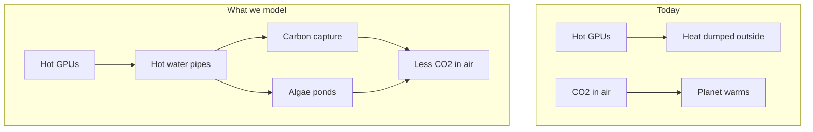
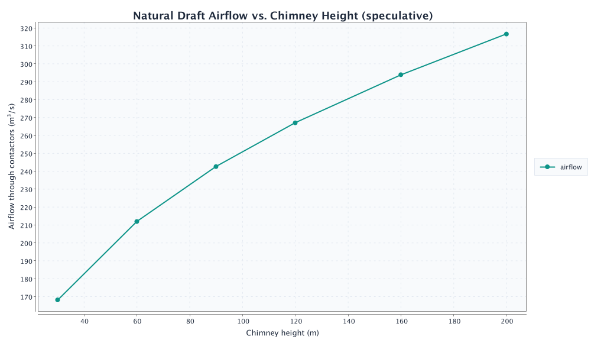
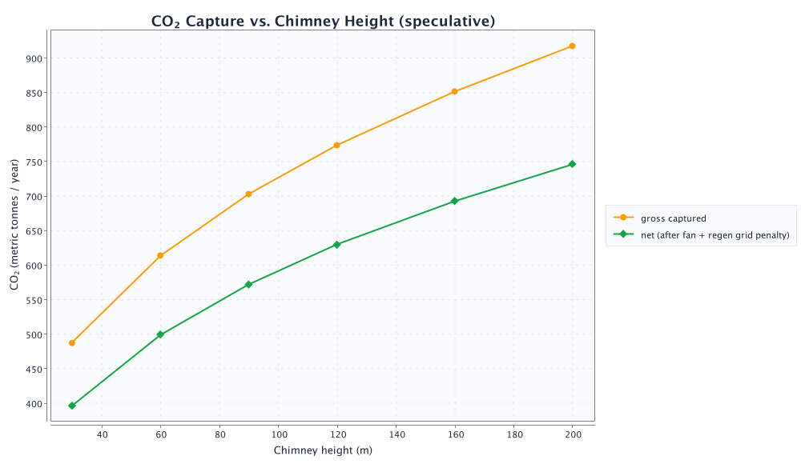
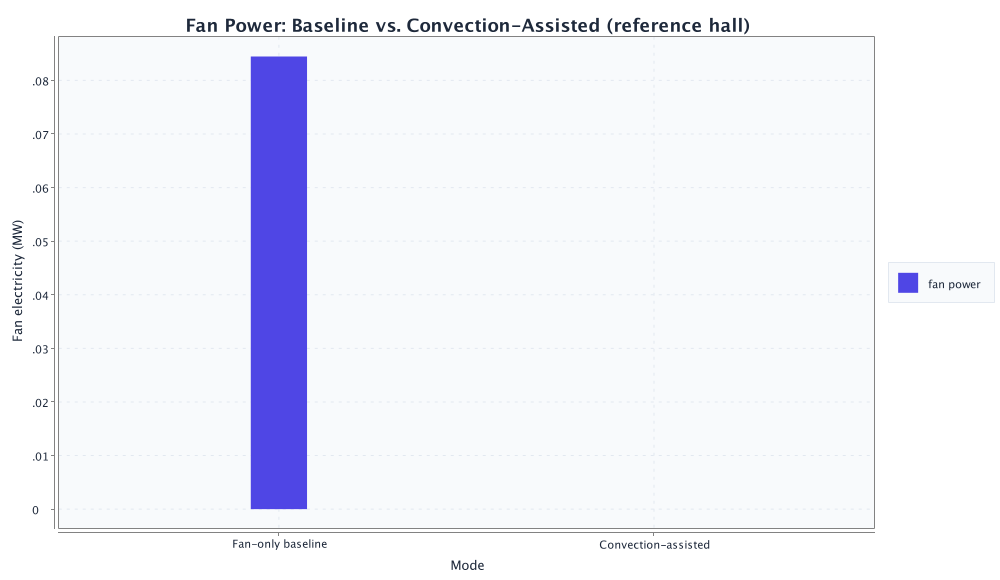
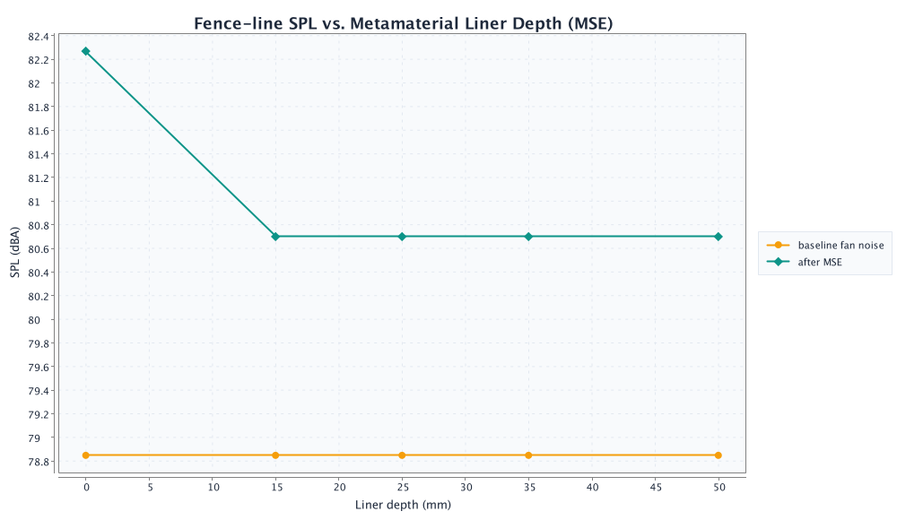
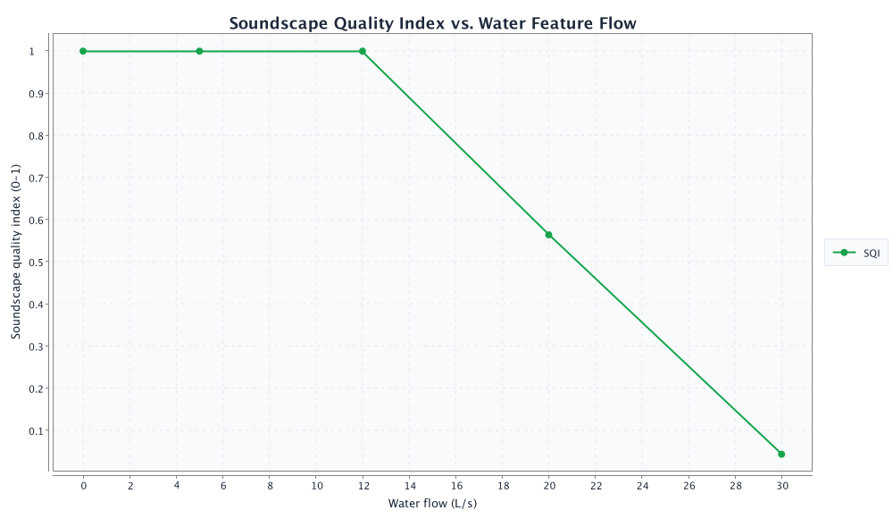
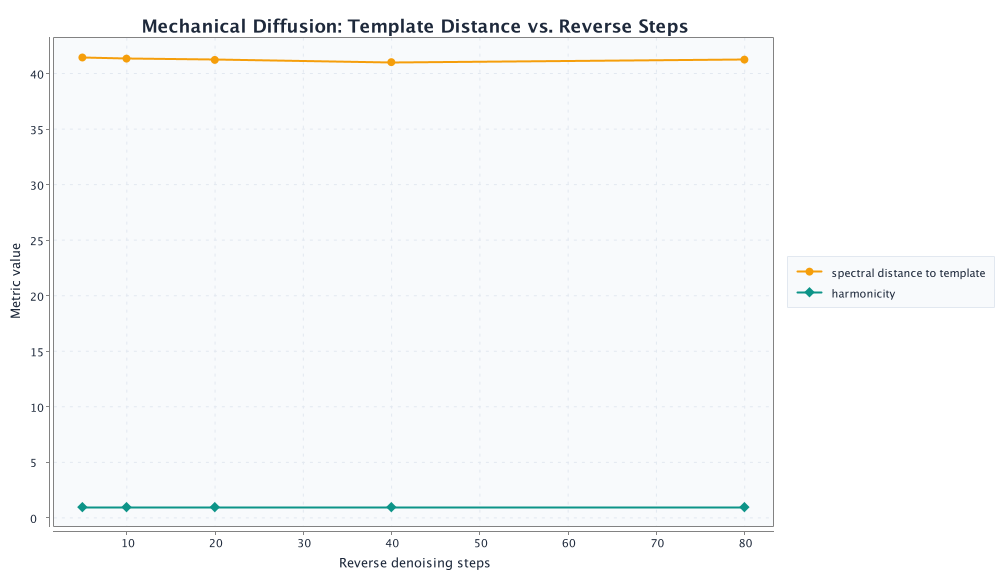
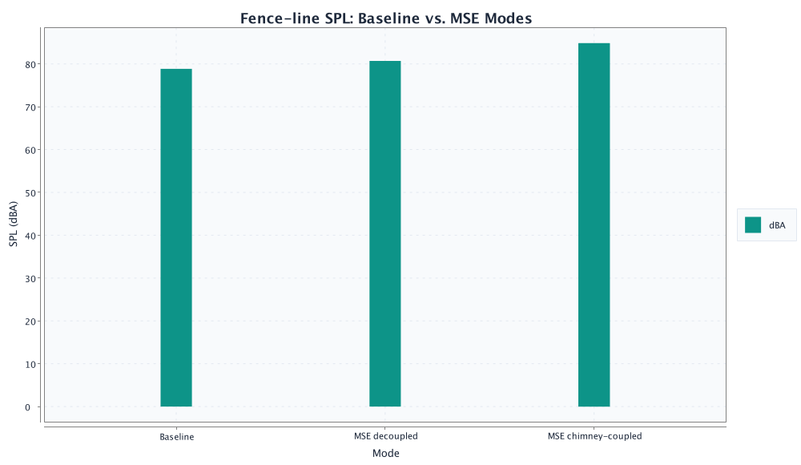

<p align="center">
  <strong>Data Center Heater Side Gig</strong><br>
  <em>Job 1: cool the GPUs. Side gig: put that exhaust to work — DAC, algae, shelter showers, acoustic soundscapes.</em>
</p>

<p align="center">
  <a href="#start-here">Start here</a> ·
  <a href="#the-big-idea">Big idea</a> ·
  <a href="#what-we-found-nvidia-us">Side gig results</a> ·
  <a href="#scalability-charts">Full analysis</a> ·
  <a href="#convection-speculative">Chimney DAC</a> ·
  <a href="#acoustic-speculative">Acoustic side gig</a> ·
  <a href="#how-the-simulation-works">Methods</a> ·
  <a href="#try-it-yourself">Run it</a> ·
  <a href="#glossary">Glossary</a>
</p>

<p align="center">
  
  
  
  
  
</p>

---

## Start here

> **In one sentence:** Data centers are giant heaters. **Job 1** is cooling the GPUs; the **side gig** is routing that exhaust to carbon capture, algae, shelter showers, and more — **before** it's thrown away.

Companies like **NVIDIA** are building huge **data centers** full of powerful **GPUs**. Almost all the electricity they use becomes **waste heat** — the data center's unwanted heater output. Today, **job 1** sends that heat outside and forgets it.

**Data Center Heater Side Gig** is a **computer simulation** of the smarter second job:

1. Capture hot water from liquid-cooled GPU loops.
2. Give that exhaust a **side gig** — **DAC**, **algae**, **pools**, **fisheries**, **shelter showers**, and more.
3. Report **MW**, **GWh/yr**, and **temperature grades** (grid-agnostic). Grid-dependent CO₂ accounting is a separate, labeled scenario.
4. *(Speculative)* Model **chimney convection** — warm exhaust rising through giant CO₂-catching walls, reducing fan power.

Read [The big idea](#the-big-idea), then [Side gig results](#what-we-found-nvidia-us). For the experimental air-side path, see [Chimney DAC](#convection-speculative).

---

## The big idea

### Job 1 vs. side gig

| | **Job 1** (what data centers do today) | **Side gig** (what we simulate) |
|---|----------------------------------------|-----------------------------------|
| **Purpose** | Keep GPUs cool enough to run | Use exhaust **before** it's wasted |
| **Typical fate** | Heat dumped to ambient | DAC, algae, showers, pools, fisheries |
| **Question** | How big are the chillers? | How much **GWh/yr** can that heat deliver? |
| **Grid assumption** | Doesn't matter — heat exists either way | Same — we lead with **thermodynamics**, not grid mix |

The name **Side Gig** is deliberate: AI training still needs cooling. We're asking what else that unavoidable exhaust could do on the way out.

### The problem (explained simply)

| What happens today | Why it matters |
|--------------------|----------------|
| GPUs crunch numbers for AI | They use a lot of electricity |
| Almost all that electricity becomes **heat** | Heat has to go somewhere |
| Data centers **cool** the chips with water or air | Then dump the heat outside |
| That heat is **waste** | It does not help anyone — yet |

### The idea we simulate



**Carbon capture (DAC)** — Special materials suck CO₂ out of the air. They need **heat** to “release” and store that CO₂. GPU waste heat can help power that process (often through a **heat pump** that warms the heat up even more).

**Algae ponds** — Tiny plants in water use sunlight to grow. As they grow, they pull CO₂ from the air (same idea as trees, but faster in the right conditions). They grow best at a **steady, warm temperature** — which waste heat can help maintain.

A **robotic controller** in our simulation decides *where* to send the heat: carbon capture, algae, storage, or emergency cooling — similar to how a smart thermostat picks where warmth should go.

### Speculative side path: chimney CO₂ capture

> **Think of it like this:** A data center is already a giant hair dryer. What if that warm air climbed a tall chimney and pulled outdoor air through CO₂-catching sponges — so you need fewer electric fans?

We added a **separate, labeled experiment** for this idea. Warm exhaust creates natural **convection** (like steam rising from soup). Air flows through passive **sorbent** walls. A **heat pump** still wrings the sponge out on a schedule — same regeneration story as liquid DAC. **Nobody has built this at campus scale yet**; our math is a cartoon, not a blueprint. Results are in [Chimney DAC (explain like I'm five)](#convection-speculative), with [paper comparisons](#convection-speculative) against Keith et al. (2018), Shi et al. (2023), Zandian & Ashjaee (2013), and Hamblin et al. (2024).

---

<!-- INTRO:BEGIN — synced from docs/results_summary.json; do not edit -->
## Side gig results (NVIDIA U.S.)

**TL;DR:** One **25,000-GPU** hall's exhaust could run a serious **side gig** — **~33.8 MW** of waste heat delivering **~70.9 GWh/yr** of usable thermal service, enough for **~28.4 million shelter hot showers/yr (~77,718/day)** or colocated DAC/algae. *Grid scenario:* ~37,776 tonnes CO₂/yr net removed.

Full thermal charts, downstream trade-offs, and the grid-dependent carbon appendix are in [Full analysis](#scalability-charts) below. Auto-generated when you run `./gradlew generateFigures`.

For a balanced DAC + algae rotation (one pipe at a time), see [balanced run](#balanced-dac--algae) in [Try it yourself](#try-it-yourself).

**Speculative chimney DAC (reference hall, 120 m tower):** ~**267 m³/s** natural draft, ~**0.08 MW** fan electricity saved, ~**630 tonnes CO₂/yr net** in the grid scenario — see [full plain-English breakdown](#convection-speculative).
<!-- INTRO:END -->

---

## GPU reference (representative NVIDIA profiles)

| GPU | Era | System heat per chip | Plain English |
|-----|-----|----------------------|---------------|
| A100 SXM | deployed | ~550 W | ~6 bright light bulbs per chip |
| H100 SXM | deployed | ~950 W | ~10 light bulbs — today's DC standard |
| B200 (liquid) | ramping | ~1,350 W | ~14 light bulbs — our reference hall chip |
| Blackwell Ultra | forecast | ~1,550 W | hotter next-gen Blackwell |
| Vera Rubin Max-P | forecast | ~2,550 W | ~25 light bulbs — liquid-only forecast |

**Reference hall:** **25,000 B200 (liquid) GPUs** ≈ **33.75 MW** waste heat (`25,000 × 1.35 kW`).

### Hall size sources (why 25k, not 37k)

| Source | What it says |
|--------|----------------|
| [ServeTheHome xAI Colossus tour](https://www.servethehome.com/inside-100000-nvidia-gpu-xai-colossus-cluster-supermicro-helped-build-for-elon-musk/) | **Four ~25,000-GPU compute halls** in the 100k H100 cluster |
| [Introl B200 deployment guide](https://introl.com/blog/nvidia-b200-vs-gb200-deployment-guide) | ~**160–224 GPUs per MW** for B200 HGX (8-GPU racks) |
| [SemiAnalysis GB200 architecture](https://semianalysis.substack.com/p/gb200-hardware-architecture-and-component) | NVL72 rack: **72 GPUs @ ~120 kW** (~1.7 kW/GPU rack power) |

An earlier draft used ~37,000 GPUs (~50 MW). That was internally consistent but **above documented single-hall sizes**. We recalibrated to **25,000 GPUs** to match real U.S. hyperscale halls.

Forecast rows use **public GTC / analyst targets**, not NVIDIA engineering data. See [`config/gpu_profiles.yaml`](config/gpu_profiles.yaml).

### How we explain the side gig (thermal first)

| Output | Role |
|--------|------|
| **MW waste heat** | The exhaust **job 1** throws away (grid-agnostic) |
| **GWh/yr thermal service** | What the **side gig** actually delivers before rejection |
| **Temperature grades** | Which side-gig loads can use available heat ([`config/thermal_grades.yaml`](config/thermal_grades.yaml)) |
| **Tonnes CO₂e/year** | *Grid scenario appendix only* — assumes 0.39 kg CO₂/kWh |

Auto-generated side-gig analysis is in [Full analysis](#scalability-charts).

---

<a id="scalability-charts"></a>

<!-- SCALABILITY:BEGIN — auto-generated by ./gradlew generateFigures; do not edit -->
## Side gig results: what hyperscale exhaust can do

*Auto-generated results for **Data Center Heater Side Gig** — **job 1** cools the GPUs; the **side gig** routes that exhaust to DAC, algae, shelter showers, and more before dissipation. We quantify MW, GWh/yr, and temperature grades (grid-agnostic). Grid-dependent carbon accounting is in the [appendix](#appendix-grid-dependent-carbon-scenario).*

### Thesis

> Data centers are giant heaters. **Job 1** is cooling the GPUs; the **side gig** is putting that exhaust to work before it's thrown away. We do not assume clean electricity — we quantify the **output-side thermodynamic potential**: how much heat is produced, what temperatures are available, and which downstream loads can use it.

### Executive summary

> **TL;DR** — One Colossus-class hall throws off **~34 MW** of waste heat and delivers **~71 GWh/yr** of usable thermal service before rejection — enough for **~28 million shelter hot showers/yr** or colocated DAC/algae loads.

#### The question

- Hyperscalers are building **~25,000-GPU liquid-cooled halls** (documented at xAI Colossus)
- Each hall runs **~34 MW of waste heat** 24/7 — usually dumped to ambient
- **What downstream processes** can use that exhaust **before it is wasted**?

#### The answer — reference hall (25k B200)

| | |
|---|---|
| **Waste heat** | **34 MW** continuous exhaust |
| **Thermal service** | **70.9 GWh/yr** delivered to loads |
| **Load split** | DAC **71** · algae **0** · rejected **0 GWh/yr** |
| **Mean delivery temp** | Buffer **53.7°C** · GPU loop **49.9°C** |

#### Downstream equivalents

- ~28.4 million shelter hot showers/yr (~77,718/day)
- **~8,865 homes**-worth of annual heat · details in [Secondary heat applications](#secondary-heat-applications)

#### Grid scenario footnote

If this heat powers DAC on today's U.S. grid: **~37,776 tonnes CO₂e/yr** net removed — see [appendix](#appendix-grid-dependent-carbon-scenario).

### How to read the outputs

| Output | Use for |
|--------|--------|
| **MW waste heat** | Continuous thermal exhaust from GPU operations (grid-agnostic) |
| **GWh/yr thermal service** | Heat actually delivered to downstream loads before rejection |
| **Temperature grades** | Which processes can physically use the available heat |
| **MWh by load** | DAC, algae, pools, fisheries, showers (translation metrics) |
| **Tonnes CO₂e/yr** | *Grid scenario only* — see appendix |

### Reference hall — thermal envelope

**25,000 B200 (liquid) GPUs** · **~34 MW** average waste heat · U.S. Southwest · 7-day sim, annualized

| Output | Reference hall |
|--------|----------------|
| Waste heat | **34 MW** (296 GWh/yr input) |
| Thermal service delivered | **70.9 GWh/yr** |
| Rejected to ambient | **0.1 GWh/yr** |
| Mean buffer temp | **53.7 °C** |
| Mean GPU loop out | **49.9 °C** |
| Mean algae pond | **24.7 °C** |

**Temperature grades** (see `config/thermal_grades.yaml`): GPU loop 40–65°C · buffer 35–55°C · DAC regeneration ~90°C (heat pump) · algae 25–30°C · aquaculture ~22°C · showers ~42°C.

| Source | Finding |
|--------|--------|
| [ServeTheHome / Supermicro](https://www.servethehome.com/inside-100000-nvidia-gpu-xai-colossus-cluster-supermicro-helped-build-for-elon-musk/) | **~25,000 GPUs per compute hall** |
| [Introl B200 guide](https://introl.com/blog/nvidia-b200-vs-gb200-deployment-guide) | **~160–224 GPUs/MW** (B200 HGX) |

### Chart 1 — Thermal service scales with GPU count

*Proportional plant growth*


*Y-axis: thermal service delivered (GWh/yr annualized from simulation)*

**Read:** Each doubling of GPUs (with scaled plant) roughly doubles **GWh/yr delivered** until equipment limits bind.

**Interpretation:** Waste-heat supply scales with accelerator inventory when downstream thermal plant is co-provisioned — the same coupling hyperscalers already practice for chillers and power. The slope flattens only when capture or distribution capacity binds, not when the grid decarbonizes.

**Highlighted point:** 25000 GPUs → **49.9 GWh/yr** thermal service at **24 MW** waste heat.

### Chart 2 — Hotter generations, same hall

*Blackwell → Rubin thermal envelope*


*Y-axis: thermal service delivered (GWh/yr annualized from simulation)*

**Read:** Same 25,000-GPU hall delivers more **GWh/yr** as chip TDP rises.

**Interpretation:** Per-GPU waste heat is an **input-side** constraint set by silicon TDP and liquid-cooling architecture (SemiAnalysis NVL72). Hotter generations increase the thermodynamic budget available to the **side gig** without expanding hall footprint — a first-order reason to size downstream plant against forecast SKUs, not today's H100 envelope.

**Highlighted point:** Blackwell Ultra → **81.4 GWh/yr** thermal service at **39 MW** waste heat.

### Chart 3 — Thermal saturation at fixed plant

*Oversized heat, fixed downstream plant*


*Y-axis: thermal service delivered (GWh/yr annualized from simulation)*

**Read:** Pasting more GPUs onto a hall **without** scaling capture plant hits a **thermal service plateau**.

**Interpretation:** This is the central engineering lesson: **exhaust exists whether or not you can use it**. Oversizing compute without matched DAC, algae, or district-heat capacity yields diminishing returns — analogous to Keith et al. (2018) plant-sizing curves, but here the binding constraint is thermal routing, not sorbent chemistry. Past saturation, **unrecovered exhaust** rises (table below) — first-law waste minus delivered service, not overlapping dry-cooler duty.

**Highlighted point:** 1.3x heat (31250 GPUs equiv.) → **70.6 GWh/yr** thermal service at **30 MW** waste heat.

| Heat multiplier | Thermal service (GWh/yr) | Unrecovered exhaust (GWh/yr) |
|-----------------|--------------------------|------------------------------|
| 0.3x heat (7500 GPUs equiv.) | **22.3** | **0.0** |
| 0.5x heat (12500 GPUs equiv.) | **22.3** | **0.0** |
| 0.8x heat (18750 GPUs equiv.) | **54.8** | **0.1** |
| 1.0x heat (25000 GPUs equiv.) | **69.4** | **0.1** |
| 1.3x heat (31250 GPUs equiv.) | **70.6** | **0.1** |
| 1.5x heat (37500 GPUs equiv.) | **70.9** | **0.1** |
| 1.8x heat (43750 GPUs equiv.) | **70.9** | **0.1** |
| 2.0x heat (50000 GPUs equiv.) | **70.9** | **355.0** |

### Chart 4 — Multi-hall campus rollout

*NVIDIA-scale campus expansion*


*Y-axis: thermal service delivered (GWh/yr annualized from simulation)*

**Read:** Ten halls ≈ 250k GPUs — cumulative **GWh/yr** scales linearly when each hall is provisioned.

**Interpretation:** Campus-scale rollouts (documented ~25k-GPU halls at Colossus) aggregate into a **district-energy** problem: hundreds of GWh/yr of colocated exhaust suitable for industrial symbiosis — pools, aquaculture, shelter heat, or capture — if thermal plumbing is planned with the campus, not retrofitted after heat is rejected.

**Highlighted point:** 20 halls → **1418.4 GWh/yr** thermal service at **675 MW** waste heat.

### Chart 5 — Thermal load split (reference hall)


*Stacked annual thermal service by downstream load (DAC priority routing).*

**Interpretation:** The stacked bars make the **policy choice** visible: the same thermodynamic budget can prioritize DAC regeneration, algae ponds, or community heat — but not all at full duty in our single-pipe MVP. Real campuses would parallelize loops; the chart shows why routing logic (and social license) matters as much as capture chemistry.

### Chart 6 — Waste heat per GPU by generation


**Input-side thermal envelope** — watts per GPU to the coolant loop (TDP + rack overhead). † = public roadmap forecast. Drives output GWh regardless of grid mix.

**Interpretation:** This timeline is the **exogenous driver** for every downstream result. Grid decarbonization changes the carbon intensity of electricity; it does **not** change the fact that ~1 kW per B200-class GPU becomes coolant heat. Campus planners should treat rising TDP as a growing **thermal asset**, not merely a cooling liability.

<a id="secondary-heat-applications"></a>

### Secondary heat applications — pools, fisheries, showers, community heat

The same **~33.8 MW** waste-heat stream can be routed to **DAC**, **heated pools**, **aquaculture raceways**, **algae**, or **shelter hot showers** (MVP: **one valve path at a time** — robot `priority` in each YAML). **Routed MWh** comes from the simulator; **pools / fisheries / algae lines are zero** when that load is not in the priority list (e.g. `nvidia_us_expansion.yaml` sends everything to DAC). **Homes** and **hot showers** are *hypothetical redirects* of the same total MWh — not simultaneous loads.

| Priority scenario | Robot order | Routed MWh/yr (pool · fish · algae · DAC) | Net CO₂e (t/yr) |
|-------------------|-------------|----------------------------------------|-----------------|
| DAC priority (climate) | carbon_capture → algae → buffer | **70,918** (0 · 0 · 0 · 70918) | 37,776 |
| Community heat (pools + fisheries) | pool → aquaculture → algae → carbon_capture → buffer | **6,510** (97 · 104 · 3409 · 2900) | 1,721 |
| Algae + DAC balanced | algae → carbon_capture → buffer | **9,894** (0 · 0 · 3683 · 6212) | 3,623 |

| Priority scenario | Hypothetical redirect (same MWh → homes / showers) |
|-------------------|------------------------------------------------------|
| DAC priority (climate) | **~8,865 homes**, **~28.4 million shelter hot showers/yr (~77,718/day)** |
| Community heat (pools + fisheries) | **~814 homes**, **~2.6 million shelter hot showers/yr (~7,134/day)** |
| Algae + DAC balanced | **~1,237 homes**, **~4.0 million shelter hot showers/yr (~10,843/day)** |

*Hot showers / homes: **hypothetical redirect** of total MWh (~2.5 kWh/shower; ~8 MWh/home-yr). Olympic pools and raceways count only when pool/aquaculture are in robot priority.*


**Trade-off (community vs. DAC priority):** ~36,055 fewer tonnes CO₂e removed per year, but **201 MWh/yr** to pools/fisheries and **~814 homes** heat equivalent — a campus **amenity + food + district heat** story alongside partial climate clawback.

- **DAC priority (climate)** — **37,776 tonnes CO₂e/yr** net. **Robot priority:** carbon_capture → algae → buffer. **Routed heat:** **70,918 MWh/yr** (pools **0** · fisheries **0** · algae **0** · DAC **70,918**). Pools and fisheries are not in the robot list — all recoverable heat goes to DAC regeneration (~71 GWh/yr). *Hypothetical redirect* (same MWh to community uses): **~8,865 homes** heat, **~28.4 million shelter hot showers/yr (~77,718/day)**.
- **Community heat (pools + fisheries)** — **1,721 tonnes CO₂e/yr** net. **Robot priority:** pool → aquaculture → algae → carbon_capture → buffer. **Routed heat:** **6,510 MWh/yr** (pools **97** · fisheries **104** · algae **3,409** · DAC **2,900**). Amenities first; DAC gets leftover heat (~2.9 GWh/yr) — large CO₂ trade-off vs climate priority. Pool service: **0.5 olympic-pool equivalents** (2.2 community pools). Fisheries: **0.4 raceways** (500 m³), **~5,393 kg fish/yr** potential. Algae: **0.19 ha** thermal service (from **3,409 MWh/yr** to ponds). *Hypothetical redirect* (same MWh to community uses): **~814 homes** heat, **~2.6 million shelter hot showers/yr (~7,134/day)**.
- **Algae + DAC balanced** — **3,623 tonnes CO₂e/yr** net. **Robot priority:** algae → carbon_capture → buffer. **Routed heat:** **9,894 MWh/yr** (pools **0** · fisheries **0** · algae **3,683** · DAC **6,212**). No pools/fisheries. Algae is first in line — daytime pond maintenance starves DAC (~6.2 GWh/yr), so total routed heat (~9.9 GWh/yr) is far below DAC-only (~71 GWh/yr). Algae: **0.21 ha** thermal service (from **3,683 MWh/yr** to ponds). *Hypothetical redirect* (same MWh to community uses): **~1,237 homes** heat, **~4.0 million shelter hot showers/yr (~10,843/day)**.

### Results at a glance

| Scenario | GPUs | Chip | Halls | **Thermal (GWh/yr)** | Net CO₂e (t/yr, grid scenario) |
|----------|------|------|-------|----------------------|-------------------------------|
| AI lab | 5,000 | H100 SXM | 1 | **10.0** | 5,317 (grid scenario) |
| One hall (H100) | 25,000 | H100 SXM | 1 | **49.9** | 26,583 (grid scenario) |
| One hall (B200) | 25,000 | B200 (liquid) | 1 | **70.9** | 37,776 (grid scenario) |
| 10-hall campus | 250,000 (25,000/hall) | B200 (liquid) | 10 | **709.2** | 377,760 (grid scenario) |
| Rubin hall | 13,200 | Vera Rubin Max-P | 1 | **70.7** | 37,675 (grid scenario) |

### Scenario narratives

Each row is a **7-day simulation** annualized to one year. Capture plant, HX, and buffer **scale proportionally** with GPU count — so **capture yield** (thermal service ÷ exhaust) stays ~similar until saturation. **Multi-hall** numbers are **×N linear extrapolation** from one simulated hall (not separate campus plumbing). DAC-priority routing: algae MWh is ~0; unrecovered exhaust stays small until heat multiplier exceeds fixed-plant capacity (see Chart 3 table).

**Lab footprint** — 5,000 × H100 SXM. **9.98 GWh/yr** thermal service from **4.75 MW** avg waste heat (**24.0% capture yield** of **41.6 GWh/yr** continuous exhaust). Split: DAC **9.98** · algae **0.00** · rejected **0.019 GWh/yr**. Grid scenario: **5,317 t CO₂e/yr** net.

**Colossus-class hall** — 25,000 × B200 (liquid). **70.92 GWh/yr** thermal service from **33.75 MW** avg waste heat (**24.0% capture yield** of **295.7 GWh/yr** continuous exhaust). Split: DAC **70.92** · algae **0.00** · rejected **0.132 GWh/yr**. Grid scenario: **37,776 t CO₂e/yr** net.

**Regional campus** — 250,000 × B200 (liquid) · 10 halls (×10 linear extrapolation). **709.18 GWh/yr** thermal service from **337.50 MW** avg waste heat (**24.0% capture yield** of **2956.5 GWh/yr** continuous exhaust). Split: DAC **709.18** · algae **0.00** · rejected **1.321 GWh/yr**. Grid scenario: **377,760 t CO₂e/yr** net.

**Rubin-era hall** — 13,200 × Vera Rubin Max-P · †forecast SKU. **70.73 GWh/yr** thermal service from **33.66 MW** avg waste heat (**24.0% capture yield** of **294.9 GWh/yr** continuous exhaust). Split: DAC **70.73** · algae **0.00** · rejected **0.132 GWh/yr**. Grid scenario: **37,675 t CO₂e/yr** net.

### Conclusion — synthesis, significance, and decision frame

> **Verdict:** Hyperscale AI is already a **district heating plant in disguise**. The **side gig** — routing **~34 MW** of continuous exhaust into **~71 GWh/yr** of deliverable thermal service per Colossus-class hall — is **thermodynamically real**, **grid-agnostic**, and **worth engineering** whether the marginal electron comes from coal, gas, solar, or geothermal.

#### Scholarly synthesis

Industrial ecology treats data centers as **energy conversion devices** whose primary product is computation and whose unavoidable coproduct is low- to medium-grade heat (Hamblin et al., 2024; Shi et al., 2023). This simulation quantifies that coproduct under documented hall sizes (ServeTheHome Colossus) and public GPU thermals (Introl B200; SemiAnalysis NVL72). The results support a **two-layer narrative**: Layer A establishes MW and GWh — physics any campus planner can bank on; Layer B, under explicit grid assumptions, asks whether DAC can **claw back** a fraction of operational CO₂ without pretending the hall is a national NET.

#### What the evidence supports

- **34 MW** of continuous waste heat — a **first-law** output of compute, independent of grid mix
- **70.9 GWh/yr** thermal service routed before rejection — sufficient for colocated DAC, algae, or **28 million shelter hot showers/yr** when prioritized for community heat
- **709 GWh/yr across 10 halls** (~338 MW aggregate) — campus-scale **industrial symbiosis** budget
- **+42% thermal headroom** (H100 → B200 at 25k GPUs) — generational TDP growth enlarges the side gig without new land
- **Saturation bound** — fixed downstream plant absorbs only **~2.2%** more GWh past ~1.3× heat input (Chart 3)
- **25% operational CO₂ recovery** under today's U.S. grid — **37,776 t/yr** removed vs **149,265 t/yr** from powering the same GPUs (grid appendix)
- **~28.4 million shelter hot showers/yr (~77,718/day)** — dignified community heat from exhaust that would otherwise be rejected
- **National scale context:** one hall's grid-scenario removal is **38 thousand tonnes** of **5,000 million tonnes** U.S. annual emissions (~**1 in 132,359**) — material for **operational clawback**, not U.S. inventory replacement

#### What the evidence does not support

- **Equating grid cleanliness with heat availability** — exhaust exists on every grid mix
- **Carbon-neutral hyperscale claims** from colocated DAC alone — reference hall remains a **net emitter** of **111,489 t/yr** after capture
- **Uncapped GPU growth without thermal plant** — GWh and tonnes **plateau** when routing saturates
- **Substituting national negative-emissions portfolios** (Minx & Fuss, 2018) with one campus loop

#### Decision frame — when the side gig is worth it

| Strategic goal | Assessment | Evidence from this run |
|----------------|------------|------------------------|
| Extract value from unavoidable exhaust | **Strong yes** | **70.9 GWh/yr** deliverable; **34 MW** continuous supply |
| Community heat / shelter showers (routing trade-off) | **Yes — explicit trade-off** | **~28.4 million shelter hot showers/yr (~77,718/day)** at DAC-priority duty |
| Co-design Blackwell/Rubin halls with downstream plant | **Yes** | +TDP raises GWh/hall when plant scales (Chart 2) |
| Partial operational CO₂ clawback (grid scenario) | **Partial — 25%** | Not neutrality; **labeled** 0.39 kg/kWh assumption |
| Prove campus carbon neutrality | **No** | Thermodynamics ≠ full lifecycle net-zero |
| Replace federal NET strategy | **No** | Tonne share ~1 in 132,359 of U.S. annual emissions per hall |

#### Closing synthesis

**Data Center Heater Side Gig** is not a blueprint for a single climate silver bullet — it is a quantitative case that **job 1's exhaust deserves job 2**. At reference scale we find **34 MW**, **70.9 GWh/yr**, temperature grades compatible with DAC and community loads, and — under honest grid bookkeeping — **25% recovery** of GPU operational CO₂. The engineering imperative is clear: **route the heat before you reject it**; the policy choice is **what the side gig serves** (capture, cultivation, or care). Climate tonnes follow from that routing decision — they do not define whether the heat exists.

<a id="appendix-grid-dependent-carbon-scenario"></a>

## Appendix: Grid-dependent carbon scenario

> **Assumption:** U.S. grid **0.39 kg CO₂/kWh**, facility **PUE 1.15**. This layer answers *net climate impact* — not whether waste heat exists.

### Operational CO₂ recovery (grid scenario)

For NVIDIA-scale infrastructure, compare DAC removal to **CO₂ from powering the same GPUs** (average waste heat × PUE 1.15 × U.S. grid 0.39 kg/kWh). This stays valid as transport electrifies.

| Scenario | GPU ops CO₂ (t/yr) | DAC net (t/yr) | **Recovery** | Net balance (t/yr) |
|----------|-------------------|-----------------|--------------|-------------------|
| 25k B200 reference | 149,265 | 37,776 | **25%** | -111,489 |
| 25k H100 | 105,038 | 26,583 | **25%** | -78,455 |
| 5k H100 lab | 21,008 | 5,317 | **25%** | -15,691 |
| 10 halls × 25k B200 | 1,492,647 | 377,760 | **25%** | -1,114,887 |

**Reference hall:** Facility draw **~383 GWh/year** (≈ 38 MW IT heat × PUE 1.15). At today's U.S. grid mix (0.39 kg CO₂/kWh), GPU operations emit **149,265 tonnes CO₂e/year**. DAC returns **37,776 tonnes CO₂e/year** — **25% operational recovery**. Still a **net emitter** of **111,489 tonnes CO₂e/year** after DAC — partial clawback, not full offset. As the grid decarbonizes, operational emissions fall but waste heat (and DAC opportunity) remain.

**Strategic framing for NVIDIA:** The **side gig** — waste-heat DAC — is **colocated carbon clawback** on heat already paid for — ~one quarter of operational CO₂ today, rising if grid greens and DAC scales with Blackwell/Rubin thermals. Not a license to build; a way to **extract value from unavoidable exhaust**.

#### CO₂ vs. GPU count

*Grid scenario*


*Y-axis: net CO₂e removed (metric tonnes per year, annualized from simulation)*

**Read:** Net tonnes scale with GPUs when plant scales.

**Interpretation:** Under explicit U.S. grid assumptions (0.39 kg CO₂/kWh), net removal tracks thermal service — but heat-pump electricity imposes a **gross-to-net penalty** documented in Keith (2018) and Shi et al. (2023). Tonnes are a **scenario layer**, not proof that exhaust exists.

**Highlighted point:** 25000 GPUs → **26,583 tonnes CO₂e/year** net removed — **27 thousand tonnes** of **5,000 million tonnes** U.S. annual emissions (~**1 in 188,090**). Roughly **~53,166 acres** of USDA cover-crop program (~119 farms), or **~5,779 cars** gasoline cars / **~13,292 cars** EVs parked for a year.

#### CO₂ vs. GPU generation

*Grid scenario*


*Y-axis: net CO₂e removed (metric tonnes per year, annualized from simulation)*

**Read:** Hotter chips → more net removal at same hall size.

**Interpretation:** Higher-TDP generations increase both operational emissions and capture potential. Recovery **%** can improve even when absolute tonnes rise — the right metric for colocated clawback, not national inventory share.

**Highlighted point:** Blackwell Ultra → **43,372 tonnes CO₂e/year** net removed — **43 thousand tonnes** of **5,000 million tonnes** U.S. annual emissions (~**1 in 115,281**). Roughly **~86,745 acres** of USDA cover-crop program (~195 farms), or **~9,429 cars** gasoline cars / **~21,686 cars** EVs parked for a year.

#### CO₂ saturation

*Grid scenario*


*Y-axis: net CO₂e removed (metric tonnes per year, annualized from simulation)*

**Read:** Fixed DAC plant → CO₂ plateau as heat rises.

**Interpretation:** Mirrors Chart 3: climate benefit from DAC **saturates** with fixed regeneration plant — a caution against marketing "more GPUs" without proportional capture infrastructure.

**Highlighted point:** 1.3x heat (31250 GPUs equiv.) → **37,597 tonnes CO₂e/year** net removed — **38 thousand tonnes** of **5,000 million tonnes** U.S. annual emissions (~**1 in 132,991**). Roughly **~75,193 acres** of USDA cover-crop program (~169 farms), or **~8,173 cars** gasoline cars / **~18,798 cars** EVs parked for a year.

#### CO₂ multi-hall

*Grid scenario*


*Y-axis: net CO₂e removed (metric tonnes per year, annualized from simulation)*

**Read:** Campus-scale cumulative net removal.

**Interpretation:** Aggregated tonnes remain **small relative to U.S. inventories** (~1 in 130 for one hall) yet material for **operational recovery** framing — partial clawback on emissions already incurred to train models, not a substitute for grid decarbonization.

**Highlighted point:** 20 halls → **755,519 tonnes CO₂e/year** net removed — **756 thousand tonnes** of **5,000 million tonnes** U.S. annual emissions (~**1 in 6,618**). Roughly **~1,511,038 acres** of USDA cover-crop program (~3396 farms), or **~164,243 cars** gasoline cars / **~377,760 cars** EVs parked for a year.

#### Gross vs. net CO₂ (heat-pump grid penalty)


*Y-axis: net CO₂e removed (metric tonnes per year, annualized from simulation)*

At **50,000 GPUs**: **65,331 tonnes** gross captured vs **53,166 tonnes** net — the gap is grid CO₂ from heat-pump electricity (~19% of gross).

As the U.S. grid decarbonizes, **GPU operational CO₂ falls** but **waste heat remains** — DAC's job is still to use that heat. Gasoline-car analogies (4.6 t/car) overstate the future; EV analogies (2.0 t/car on today's grid) are a better tailpipe mental model. **Tonnes and % recovery** stay the right metrics either way.

### FAQ

**Why lead with GWh, not CO₂?** Waste heat is a **physical output** of compute — it exists whether the grid is coal, gas, solar, nuclear, or geothermal. GWh and temperature grades are grid-agnostic.

**When does grid carbon matter?** When you ask whether DAC **net-removes** CO₂ after heat-pump electricity — see the [grid appendix](#appendix-grid-dependent-carbon-scenario).

**Pools, fisheries, showers vs. DAC?** Same exhaust, different router priority — a **policy choice** about where to send thermal service before dissipation.

### Generated at: 2026-06-05T10:48:53.165203Z

### Sources

- Hall sizing: ServeTheHome xAI Colossus; Introl B200; SemiAnalysis NVL72
- Thermal grades: `config/thermal_grades.yaml`; heat analogies: `config/heat_applications.yaml`
- Grid scenario: U.S. grid 0.39 kg CO₂/kWh, PUE 1.15 (`config/nvidia_us_expansion.yaml`)
- Forecast SKUs: public GTC roadmaps — not NVIDIA confidential data
<!-- SCALABILITY:END -->

---

## How the simulation works

This section is the **method** — how we turned a real-world question into numbers. Written so a motivated high-school student can follow it.

### Step 1 — Build a virtual power plant

We coded a **digital twin** in Java: a simplified copy of pipes, pumps, tanks, and controllers. Every **60 seconds** of simulated time, the computer updates temperatures, flows, and CO₂ totals.


### Step 2 — Physics (the science rules)

We use honest-but-simplified engineering math:

| Rule | What it means | Analogy |
|------|---------------|---------|
| **Heat moves from hot to cold** | GPU loop → heat exchanger → storage tank | Pouring hot tea into a cold mug |
| **Q = ṁ × c × ΔT** | Flow rate × heat capacity × temperature change = power | How much “thermal energy” water carries |
| **Heat exchanger** | Transfers heat without mixing fluids | Two zippered pockets touching — heat crosses, liquids do not |
| **Reject path** | Emergency radiator to ambient | Opening a window when too hot |
| **Safety first** | GPUs must never overheat | Simulation always protects chips before optimizing CO₂ |

### Step 3 — Carbon capture model

1. Hot water from the data center enters a **secondary loop**.
2. A **heat pump** (like an AC unit in reverse) boosts that heat to ~**90 °C**.
3. Hot sorbent material **releases** captured CO₂ for storage.
4. CO₂ captured per second ≈ **heat delivered ÷ energy needed per kg CO₂** (~5.5 MJ/kg in our defaults).

If source water is **below 40 °C**, the heat pump **stalls** — like trying to bake cookies in an oven that never preheated.

### Step 4 — Algae model

Algae growth depends on three knobs we multiply together:

```
growth = surface area × daylight × temperature comfort × CO₂ bonus from DAC
```

| Factor | Intuition |
|--------|-----------|
| **Daylight** | No sun at night → no photosynthesis |
| **Temperature** | Best around **28 °C**; too cold or too hot slows growth |
| **DAC CO₂ bonus** | Bubbling captured CO₂ into ponds can speed growth |

Waste heat **does not replace sunlight**. It **keeps the water warm** so daytime growth stays efficient.

### Step 5 — Climate scorecard

We report:

| Metric | Formula (simplified) |
|--------|----------------------|
| **Gross removal** | DAC kg + algae kg |
| **Electricity penalty** | heat-pump kWh × U.S. grid CO₂ factor (0.39 kg/kWh) |
| **Net CO₂e removed** | gross − penalty |
| **Annualized tonnes** | scale 30-day or 1-year run to 365 days |

> **Important:** “Warming offset in milli-Kelvin” in the output is a **teaching toy**, not a NASA climate model. Trust **net tonnes CO₂e** for the real story.

### Step 6 — What we assume (and what we do not)

| We model | We do not model (yet) |
|----------|----------------------|
| Heat flow, pumps, valves | Real NVIDIA facility blueprints |
| DAC + algae + routing | Storing CO₂ underground |
| 30-day / annualized scaling | Full 365-day weather file per city |
| U.S. average grid emissions | Hour-by-hour grid greenness |
| One load connected at a time | Parallel pipes to all systems |
| *(Speculative)* Chimney convection DAC | CFD, real sorbent chemistry, built campus pilots |

Assumptions are documented in [`config/nvidia_us_expansion.yaml`](config/nvidia_us_expansion.yaml) and [`config/passive_convection_capture.yaml`](config/passive_convection_capture.yaml).

### Step 7 — Speculative chimney convection (optional module)

A separate air-side experiment asks: *can warm exhaust pull air through CO₂-catching walls without as many fans?*

1. Some **reject heat** warms a tall chimney (stack effect — hot air rises).
2. Rising air sucks outdoor air through **sorbent contactors** (adsorb phase, ~8 h).
3. A **heat pump** regenerates the sorbent on a schedule (~2 h) — same liquid-loop story as Step 3.
4. We compare **fan baseline** vs **convection-assisted** fan power and count net CO₂.

Plain-English results: [Chimney DAC](#convection-speculative). Regenerate with `./gradlew generateConvectionFigures`.

---

## Try it yourself

### Prerequisites

- **Java 20+**
- Terminal access

### Quick demo (1 hour of simulated time)

```bash
./gradlew test
./gradlew run --args="--fast"
```

### NVIDIA U.S. expansion (30 simulated days)

```bash
./gradlew run --args="--config config/nvidia_us_expansion.yaml --scenario nvidia_us_module"
```

### Balanced DAC + algae {#balanced-dac--algae}

Rotation between algae and carbon capture (one pipe at a time in this MVP):

```bash
./gradlew run --args="--config config/nvidia_us_algae.yaml --scenario nvidia_us_module"
```

### Speculative convection DAC (30 simulated days)

Passive chimney airflow through CO₂-catching walls — experimental idea, not deployed at scale:

```bash
./gradlew run --args="--config config/nvidia_us_convection.yaml --scenario nvidia_us_module --fast"
```

Regenerate convection charts and kindergarten-level README section:

```bash
./gradlew generateConvectionFigures
```

### Speculative acoustic side gig (MSE + MDMG)

Mechanical soundscape equalizer and mechanical diffusion music generator — experimental noise valorization:

```bash
./gradlew generateAcousticFigures
```

Writes charts to `docs/figures/`, WAV clips to `docs/audio/`, and patches the [acoustic section](#acoustic-speculative).

### MDMG SOTA benchmark (Java-first)

Train Java latent diffusion, distill mechanical landscape, and compare tiers:

```bash
./gradlew trainLatentDiffusion
./gradlew trainMdmgLandscape
./gradlew generateMdmgBenchmark
```

See [MDMG benchmark](#mdmg-benchmark) and [Mechanical Diffusion Model concept](docs/mdmg_concept.md).

### Regenerate scalability charts and README results

Runs 7-day sweeps, writes PNGs to `docs/figures/`, updates `docs/results_summary.json`, and patches the [scalability section](#scalability-charts) (LLM if `OPENAI_API_KEY` is set, otherwise template fallback):

```bash
export OPENAI_API_KEY=sk-...   # optional — enables LLM-written explanations
./gradlew generateFigures
```

### What to look for in the output

```
--- CO2 Removal ---
DAC CO2 captured:     ...
Algae CO2 fixed:      ...
Net CO2e removed:     ...

--- Climate Impact (illustrative) ---
Annualized net removal: ... tonnes CO2e/yr
```

---

<a id="convection-speculative"></a>

<!-- CONVECTION:BEGIN — auto-generated by ./gradlew generateConvectionFigures; do not edit -->
## Speculative idea: chimney CO₂ capture (explain like I'm five)

*Auto-generated **speculative** results — passive convection through giant CO₂-catching walls. Not mixed with main thermal results. See [Glossary](#glossary) for simple definitions.*

> **In one sentence:** Warm exhaust rises like a chimney and drags air through CO₂-catching walls — so we need fewer electric fans.

### Picture this

| Complicated word | Think of it like… |
|------------------|-------------------|
| Fans | The chimney does part of the leaf-blower's job. |
| CO₂ capture sponge | A sponge in the air that grabs CO₂ molecules. |
| Convection / chimney | Hot air rises like steam from soup — it pulls more air along. |
| Regeneration | Heating the sponge to squeeze the CO₂ out, like wringing a towel. |
| Waste heat | Computers get hot like a game console — that warmth is waste heat. |

### What the simulation tried (still experimental in real life)

1. GPUs make heat → some goes into a tall warm chimney
2. Rising warm air sucks outdoor air through giant capture walls
3. Sponges fill up → heat pump squeezes CO₂ out (same as our liquid DAC model)
4. Count CO₂ caught, fans saved, electricity still needed

### Results in plain English

| Question a kid might ask | What we found |
|--------------------------|---------------|
| Is the data center a heater? | Yes. Almost all the electricity becomes heat. |
| Why a tall tower? | Taller warm column = stronger upward pull. |
| Do we still need fans? | Usually yes, but smaller or weaker ones. |
| Do we still need hot water for the sponge? | Yes — catching is passive; squeezing still needs heat. |
| Did we build this for real? | No. This is a computer experiment only. |
| How much air does the chimney pull? | About **267 m³/s** at our reference size |
| How much fan electricity do we save? | About **0.08 MW** vs. fan-only baseline |
| How much CO₂ per year (computer guess)? | **630 tonnes net** after electricity penalty |

### Then the numbers

**Reference hall** (~39.5 MW waste heat, 120 m chimney, 50000 m² contactors):

| Metric | Value |
|--------|-------|
| Airflow | **267 m³/s** |
| Exhaust ΔT | **42.9 K** above ambient |
| Fan baseline | **0.08 MW** |
| Fan with convection | **0.00 MW** |
| Fan saved | **0.08 MW** |
| Gross CO₂ captured | **774 t/yr** |
| Net CO₂ (grid scenario) | **630 t/yr** |







### Chart interpretations

**Airflow vs. chimney height** — Draft scales with stack height per buoyancy theory (Zandian & Ashjaee, 2013). Sweep spans **30–200 m** → **168–317 m³/s**, confirming that taller warm columns materially increase passive throughput — the same lever cooling towers use, repurposed for CO₂ contact.

**CO₂ vs. contactor area** — Capture rate tracks sorbent face area until mass-transfer or regeneration duty binds. **10,000–100,000 m²** spans **91–1950 t/yr** gross — linear at this lumped fidelity, but still **orders of magnitude** below Mt-scale DAC literature (Keith 2018; McQueen 2021).

**Fan savings vs. waste-heat coupling** — Fraction of hall heat routed to the air chimney (**10–50%** of **40 MW**) drives ΔT and draft. Fan duty falls from **0.02 to 0.12 MW** — modest in absolute terms because baseline fan power is small at this contactor resistance, but directionally consistent with passive-air DAC concepts (Lackner 2018).

### How this compares to published research

Our speculative chimney model sits at the intersection of three literatures:
(1) **DAC regeneration energy** from low-grade heat, (2) **natural-draft chimneys**
for moving large air volumes, and (3) **data-center waste heat** as a colocated
thermal source. No published study yet combines all three at AI-campus scale —
that gap is why we label this module experimental.

**arXiv & top reviews — net zero & negative emissions:** [Lee, G.A., Shi, X., & Park, A.A. (2022)](https://arxiv.org/abs/2211.00791); [Minx, J.C., et al. (2018)](https://doi.org/10.1088/1748-9326/aabf9b); [Fuss, S., et al. (2018)](https://doi.org/10.1088/1748-9326/aabf9f); [Zhang, X., et al. (2025)](https://arxiv.org/abs/2510.12949)

**arXiv & reviews — DAC scaling:** [McQueen, N., et al. (2021)](https://doi.org/10.1088/2516-1083/abf1ce); [Zhang, X., et al. (2025)](https://arxiv.org/abs/2510.20135)

**Peer-reviewed DAC & chimney physics:** [Keith, D.W., Holmes, G., St. Angelo, D., & Heidel, K. (2018)](https://doi.org/10.1016/j.joule.2018.05.006); [Sabatino, F., et al. (2023)](https://doi.org/10.1016/j.jcou.2023.102587); [Shi, W.K., Zhang, X.J., Liu, X., Wei, S., Shi, X., Wu, C., & Jiang, L. (2023)](https://doi.org/10.1016/j.jclepro.2023.137889); [Hamblin, L., Lackner, K.S., & Green, M.D. (2024)](https://proceedings.aiche.org/conferences/aiche-annual-meeting/2024/proceeding/paper/365o-integration-low-grade-waste-heat-direct-air-capture-co2-systems-data-center-case-study); [Lackner, K.S., et al. (Arizona State University) (2018)](https://www.energy.gov/sites/prod/files/2018/10/f56/Klaus_Lackner_CCE_PanelDay2.pdf); [Zandian, A., & Ashjaee, M. (2013)](https://doi.org/10.1016/j.renene.2012.09.051); [Real, F.S., et al. (2023)](https://doi.org/10.1016/j.oneear.2023.11.004); [Meta; Alphabet X (reported by DataCenterDynamics, 2024) (2024)](https://www.datacenterdynamics.com/en/news/meta-and-alphabets-x-developing-direct-air-capture-systems-using-data-center-waste-heat/)

**Nuclear + DAC comparisons (cited, not modeled):** [Bertoni, L., et al. (2024)](https://doi.org/10.1088/2515-7655/ad2374); [NETL / U.S. DOE (2023)](https://www.osti.gov/biblio/1998558); [McQueen, N., et al. (2020)](https://doi.org/10.3389/fclim.2020.618644); [Qvist, S.H., & Staffell, I. (2022)](https://doi.org/10.1016/j.ijggc.2022.103745)

| Paper | What they report | How our sim compares |
|-------|------------------|----------------------|
| [Lee, G.A., Shi, X., & Park, A.A. (2022)](https://arxiv.org/abs/2211.00791) | DAC review for **negative emissions** and carbon-neutral world building; surfaces sorbent/solvent advances | Frames DAC as a **negative-emission technology** — same role as our grid-scenario CO₂ appendix, not our thermal-first story. |
| [Minx, J.C., et al. (2018)](https://doi.org/10.1088/1748-9326/aabf9b) | 1.5 °C paths need **large-scale NETs**; no single NET suffices — portfolios required | Supports treating DAC as **one tool among many**, not a silver bullet; matches our modest ~600 t/yr chimney result. |
| [Fuss, S., et al. (2018)](https://doi.org/10.1088/1748-9326/aabf9f) | NET cost/potential ranges; **DAC** among options with trade-offs and side effects | Reminds us every NET has **risks and limits** — including energy penalty and land/fan infrastructure for DAC. |
| [Zhang, X., et al. (2025)](https://arxiv.org/abs/2510.12949) | Current decarbonization **falls short of net-zero**; DAC must navigate **grid electricity** cost and emissions | We use a **flat grid factor**, not hourly markets — but the paper warns net removal depends on *when* you run fans/heat pumps. |
| [McQueen, N., et al. (2021)](https://doi.org/10.1088/2516-1083/abf1ce) | Gigaton scale needs **~50%/yr growth**; learning-by-doing; solid + liquid commercial paths | Our throughput is **pre-commercial** — useful for physics intuition, not deployment planning. |
| [Zhang, X., et al. (2025)](https://arxiv.org/abs/2510.20135) | Solar-thermal regen at ~100 °C; **~$200/t-CO₂** LCCO₂ in sun-rich sites | Alternative low-carbon heat to **nuclear** — we use **DC waste heat** instead of solar thermal. |
| [Bertoni, L., et al. (2024)](https://doi.org/10.1088/2515-7655/ad2374) | 50 MW SMR + solid DAC: **~0.3 MtCO₂/yr**; **~250 €/t** net removal | **Not modeled.** Cited to show nuclear papers target **1,000×** our capture scale with different energy assumptions. |
| [NETL / U.S. DOE (2023)](https://www.osti.gov/biblio/1998558) | 1 GWₜ NPP + L-DAC: **12–15 MtCO₂/yr**; LCOD **$170–260/t** (liquid) vs **$650–680/t** (solid) | **Not modeled.** Illustrates why nuclear dominates some DAC cost studies — steady heat + electricity. |
| [McQueen, N., et al. (2020)](https://doi.org/10.3389/fclim.2020.618644) | 1 Mt/yr solvent DAC: **$370–620/t** with nuclear; **$250–690/t** range across energy sources | **Not modeled.** Our heat-pump penalty uses **grid average**, not nuclear-specific ~0 gCO₂/kWh. |
| [Qvist, S.H., & Staffell, I. (2022)](https://doi.org/10.1016/j.ijggc.2022.103745) | 2050 median LCO₂ removed: **$101.6/t** (71–154 $/t); flags **non-economic** barriers | **Not modeled.** Paper itself notes waste, proliferation, and social-license risks beyond economics. |
| [Keith, D.W., Holmes, G., St. Angelo, D., & Heidel, K. (2018)](https://doi.org/10.1016/j.joule.2018.05.006) | 5.25–8.81 GJ/t-CO₂ thermal + 77–366 kWh/t electric; $94–232/t levelized (1 Mt/yr plant) | Our default regen duty is **5.5 GJ/t-CO₂** — inside the Keith solvent-DAC envelope. |
| [Sabatino, F., et al. (2023)](https://doi.org/10.1016/j.jcou.2023.102587) | Solid sorbent regen: **0.5–18.75 GJ/t**; liquid solvent: **0.62–17.28 GJ/t** | Heat-pump-boosted 90 °C regen is a conventional TSA approach within this range. |
| [Shi, W.K., Zhang, X.J., Liu, X., Wei, S., Shi, X., Wu, C., & Jiang, L. (2023)](https://doi.org/10.1016/j.jclepro.2023.137889) | TVSA + heat pump at 373 K: **176.7 $/t** LCOD; low-grade heat cuts net LCOD 5–25% | Closest analog to **waste-heat + heat-pump regen** in our cyclic convection module. |
| [Hamblin, L., Lackner, K.S., & Green, M.D. (2024)](https://proceedings.aiche.org/conferences/aiche-annual-meeting/2024/proceeding/paper/365o-integration-low-grade-waste-heat-direct-air-capture-co2-systems-data-center-case-study) | Multi-stage liquid sorbent upgrade using integrated DC waste heat | **Closest DC + DAC case study** to our main liquid-loop path (not the chimney variant). |
| [Lackner, K.S., et al. (Arizona State University) (2018)](https://www.energy.gov/sites/prod/files/2018/10/f56/Klaus_Lackner_CCE_PanelDay2.pdf) | Wind-driven contactors; minimal active fanning; moisture-swing regen | Conceptual predecessor to **passive air contact** — chimney draft replaces wind. |
| [Zandian, A., & Ashjaee, M. (2013)](https://doi.org/10.1016/j.renene.2012.09.051) | HCTSC: **~10×** draft vs. Manzanares; up to **3 MW** with 50 m diameter | Validates **waste-heat-warmed chimneys** as airflow engines. |
| [Real, F.S., et al. (2023)](https://doi.org/10.1016/j.oneear.2023.11.004) | Four DAC technologies plateau **$100–600/t-CO₂** by 2050; unlikely to hit $100/t everywhere | Includes **nuclear+heat-pump** scenarios we do **not** run — cited for cost context only. |
| [Meta; Alphabet X (reported by DataCenterDynamics, 2024) (2024)](https://www.datacenterdynamics.com/en/news/meta-and-alphabets-x-developing-direct-air-capture-systems-using-data-center-waste-heat/) | Liquid DAC + heat-pump regen from DC exhaust | Industry pursues **liquid regen**, not passive chimney contactors. |

**Our reference run vs. literature scale:**

| Metric | This sim | Typical published DAC plant |
|--------|----------|----------------------------|
| Annual capture | **774 t/yr** | 0.9–1,000,000 t/yr (Keith 2018; McQueen 2020) |
| Regen heat duty | **5.5 GJ/t-CO₂** (config default) | 0.5–18.75 GJ/t (Sabatino 2023 review) |
| Air movement | **267 m³/s** natural draft | Fan-driven contactors in commercial DAC |
| Fan electricity saved | **0.08 MW** | Not reported — fans usually fully powered |

### What the papers do and do not cover

| Question | Answer from literature |
|----------|------------------------|
| Has anyone built chimney DAC at a GPU campus? | Not in published literature. Zandian & Ashjaee (2013) use power-plant cooling towers; Hamblin et al. (2024) study DC liquid-loop DAC — neither is our exact design. |
| Is 5.5 GJ per tonne of CO₂ realistic? | Yes — Keith et al. (2018) report 5.25–8.81 GJ/t; Sabatino et al. (2023) survey 0.5–18.75 GJ/t across sorbent types. |
| Why is our capture only ~600 tonnes/year? | Commercial papers size plants at **0.9–1 Mt/yr** (Keith 2018). Nuclear studies target **0.3–15 Mt/yr** per reactor — we model one hall with lumped contactor area. |
| Why don't we use nuclear if papers say it's cheaper? | We deliberately use **grid-average electricity** and **existing GPU waste heat** — not new reactors. Nuclear DAC papers assume steady carbon-free power; they also downplay waste, accident, and proliferation concerns that many people find unacceptable. |
| What do net-zero papers say about DAC? | Minx & Fuss (2018) and Lee et al. (arXiv:2211.00791) treat DAC as one **negative-emission tool** in a portfolio — necessary at scale for 1.5 °C, but not sufficient alone. |

#### Full references

- Lee, G.A., Shi, X., & Park, A.A. (2022). *Technologies to Capture CO₂ directly from Ambient Air.* arXiv (physics.chem-ph). arXiv:2211.00791 — https://arxiv.org/abs/2211.00791
- Minx, J.C., et al. (2018). *Negative emissions — Part 1: Research landscape and synthesis.* Environmental Research Letters. https://doi.org/10.1088/1748-9326/aabf9b
- Fuss, S., et al. (2018). *Negative emissions — Part 2: Costs, potentials and side effects.* Environmental Research Letters. https://doi.org/10.1088/1748-9326/aabf9f
- Zhang, X., et al. (2025). *Enhancing Profit and CO₂ Mitigation: Commercial DAC Design and Operation with Power Market Volatility.* arXiv. arXiv:2510.12949 — https://arxiv.org/abs/2510.12949
- McQueen, N., et al. (2021). *A review of direct air capture (DAC): scaling up commercial technologies and innovating for the future.* Progress in Energy. https://doi.org/10.1088/2516-1083/abf1ce
- Zhang, X., et al. (2025). *Design Optimization and Global Impact Assessment of Solar-Thermal Direct Air Carbon Capture.* arXiv. arXiv:2510.20135 — https://arxiv.org/abs/2510.20135
- Bertoni, L., et al. (2024). *Integrating direct air capture with small modular nuclear reactors.* Journal of Physics: Energy. https://doi.org/10.1088/2515-7655/ad2374
- NETL / U.S. DOE (2023). *Assessment of Nuclear Energy to Support Negative Emission Technologies.* DOE Technical Report. https://www.osti.gov/biblio/1998558
- McQueen, N., et al. (2020). *Natural Gas vs. Electricity for Solvent-Based DAC (incl. nuclear scenarios).* Frontiers in Climate. https://doi.org/10.3389/fclim.2020.618644
- Qvist, S.H., & Staffell, I. (2022). *The prospects of massively scalable nuclear-powered direct air capture.* International Journal of Greenhouse Gas Control. https://doi.org/10.1016/j.ijggc.2022.103745
- Keith, D.W., Holmes, G., St. Angelo, D., & Heidel, K. (2018). *A process for capturing CO₂ from the atmosphere.* Joule. https://doi.org/10.1016/j.joule.2018.05.006
- Sabatino, F., et al. (2023). *A comprehensive review on regeneration strategies for direct air capture.* Journal of CO₂ Utilization. https://doi.org/10.1016/j.jcou.2023.102587
- Shi, W.K., Zhang, X.J., Liu, X., Wei, S., Shi, X., Wu, C., & Jiang, L. (2023). *Temperature-vacuum swing adsorption for direct air capture by using low-grade heat.* Journal of Cleaner Production. https://doi.org/10.1016/j.jclepro.2023.137889
- Hamblin, L., Lackner, K.S., & Green, M.D. (2024). *Integration of Low-Grade Waste Heat in DAC — A Data Center Case Study.* 2024 AIChE Annual Meeting. https://proceedings.aiche.org/conferences/aiche-annual-meeting/2024/proceeding/paper/365o-integration-low-grade-waste-heat-direct-air-capture-co2-systems-data-center-case-study
- Lackner, K.S., et al. (Arizona State University) (2018). *Passive wind-driven direct air capture with moisture-swing sorbents.* U.S. DOE CCE workshop / ASU Tiburio design. https://www.energy.gov/sites/prod/files/2018/10/f56/Klaus_Lackner_CCE_PanelDay2.pdf
- Zandian, A., & Ashjaee, M. (2013). *Hybrid cooling tower and solar chimney concept.* Renewable Energy. https://doi.org/10.1016/j.renene.2012.09.051
- Real, F.S., et al. (2023). *The cost of DAC and storage can be reduced via strategic deployment.* One Earth. https://doi.org/10.1016/j.oneear.2023.11.004
- Meta; Alphabet X (reported by DataCenterDynamics, 2024) (2024). *Direct air capture prototypes using data-center waste heat.* Industry reports (not peer-reviewed). https://www.datacenterdynamics.com/en/news/meta-and-alphabets-x-developing-direct-air-capture-systems-using-data-center-waste-heat/

### Energy assumptions — no nuclear inputs

**This simulator does not assume nuclear power** for data-center operation or DAC
regeneration. Grid-dependent CO₂ accounting uses the **U.S. average grid** (0.39 kg
CO₂/kWh in our default configs) — not nuclear-specific carbon intensity.

We cite nuclear+DAC papers below for **honest comparison only**. Many find lower
levelized costs when pairing DAC with steady nuclear heat/electricity, but we
deliberately do **not** model that pathway here.

**Why we cite nuclear papers but don't use them:** Several studies (Bertoni et al.
2024; DOE NETL 2023; McQueen et al. 2020; Qvist & Staffell 2022) report that
nuclear can cut DAC costs by ~7–13% versus fossil-powered baselines, with removal
costs often quoted around **$100–250/t-CO₂** at large scale. Those results depend
on assumptions about reactor build rates, waste handling, proliferation risk,
accident tail risk, long-lived radioactive waste, and social license — topics we
treat as **outside scope and genuinely concerning** for many communities.

**Our alternative framing:** use **waste heat that already exists** from GPUs
(Hamblin 2024; Meta/X industry reports) and **passive airflow** (Lackner 2018;
Zandian 2013) rather than building new nuclear capacity to feed DAC.

### Conclusion — synthesis and research positioning

> **Verdict:** Chimney convection is a **credible physics sketch**, not a deployment plan. At reference scale (**120 m** stack, **50,000 m²** contactors, **39.5 MW** waste heat) passive draft moves **267 m³/s** (sweep range **168–317 m³/s**), saves **0.08 MW** fan duty, and yields **630 t/yr** net CO₂ under grid scenario — roughly **1163× below** a 0.9 Mt/yr Keith-class plant, but aligned with the **side-gig philosophy**: use exhaust already on site before building new energy infrastructure.

#### Scholarly synthesis

This module occupies a **deliberate gap** in the literature: Hamblin et al. (2024) integrate liquid-loop DC waste heat; Lackner (2018) and Zandian & Ashjaee (2013) motivate passive airflow; Keith (2018) and McQueen (2021) size Mt-scale fan-driven plants. No peer-reviewed study yet combines **GPU-campus exhaust**, **chimney draft**, and **cyclic sorbent regeneration** at hyperscale. Our lumped solver therefore functions as a **feasibility screen**: it asks whether buoyancy and bed resistance permit useful airflow without claiming commercial LCO₂.

#### What the sweep supports

- **Height sensitivity** — taller chimneys increase draft monotonically in our sweep (168–317 m³/s)
- **Contactor area dominates throughput** — **774 t/yr** gross at reference **50,000 m²** face
- **Regeneration penalty** — **19%** gross-to-net gap from heat-pump electricity (5.5 GJ/t duty, grid 0.39 kg/kWh) — consistent with solvent-DAC literature
- **Fan substitution is real but small** — **0.08 MW** saved vs. **39.5 MW** hall heat — Opex lever, not primary climate story

#### What it does not support

- **Campus-scale negative emissions** without orders-of-magnitude larger contactor area or multi-hall aggregation
- **Replacing liquid-loop DAC** pursued by industry (Meta/X) — air-side path remains more speculative
- **Nuclear or dedicated low-carbon heat** — we deliberately use **existing GPU exhaust** only (see energy policy above)

#### Relationship to the main side gig

The **primary** Data Center Heater Side Gig story routes **liquid** waste heat to DAC and community loads (~**71 GWh/yr** per hall). Chimney convection is an **air-side appendix**: same regeneration chemistry, different contactor physics. If passive draft reduces fan Opex and enables larger face area at fixed electricity, it merits pilot study; if not, the liquid path remains the conservative baseline (Shi et al., 2023; Hamblin et al., 2024).

#### Closing synthesis

Treat this module as **structured speculation**: physics plausible, economics unproven, scale pre-commercial. It strengthens the broader thesis that hyperscale exhaust is **too large to ignore** — whether captured through pipes or chimneys — while keeping climate claims **proportionate** to **630 t/yr** net removal at reference geometry, not Mt-scale promises from the DAC literature.

### Honest limits

- Nobody runs this at campus scale yet
- Our math is a cartoon, not a blueprint
- Liquid-cooled halls may need extra steps to warm the air chimney
- Speculative — physics is plausible, real plants are not built yet. Computer experiment only.

### Generated at: 2026-06-05T10:49:04.246930Z

### Sources

- Physics: lumped buoyancy + porous-bed resistance (`src/main/java/com/heater/carbon/ConvectionCapturePhysics.java`)
- Defaults: `config/passive_convection_capture.yaml`
- Analogies: `config/convection_analogies.yaml`
- Literature: `config/convection_references.yaml`
- Speculative — physics is plausible, real plants are not built yet. Computer experiment only.
<!-- CONVECTION:END -->

---

<!-- ACOUSTIC:BEGIN — auto-generated by ./gradlew generateAcousticFigures; do not edit -->
<a id="acoustic-speculative"></a>

## Speculative side gig: acoustic valorization (explain like I'm five)

*Auto-generated **speculative** results — mechanical soundscape equalizer (MSE) and mechanical diffusion music generator (MDMG). Not mixed with main thermal CO₂ results.*

> **In one sentence:** Turn the data center's loud fan hum into a softer nature soundscape — or even music — using pipes, water, and tuned metal, not speakers.

### Picture this

| Complicated word | Think of it like… |
|------------------|-------------------|
| Metamaterial liner | Thin honeycomb panels that eat the harshest fan tones like earplugs with holes for air. |
| Water soundscape | Warm exhaust can push water over rocks — trickling sounds that feel like a stream. |
| Organ pipes | Chimney air can blow across tuned pipes — turning part of the hum into notes. |
| Fan noise | Thousands of fans whir like leaf blowers in a stadium — mostly steady tones plus whoosh. |
| Mechanical diffusion | Springs and masses that slowly shake noise into smoother, music-like patterns — like clay on a wheel. |

### What the simulation tried (still experimental in real life)

1. Measure fan noise as tones (blade passing frequency) plus broadband whoosh
2. Pass exhaust through metamaterial liners that cancel harsh tones (with a fan-power penalty)
3. Add water features, organ pipes, and chimes driven by exhaust or chimney draft
4. Optionally run fan noise through a coupled-oscillator 'mechanical diffusion' stack
5. Report fence-line loudness, soundscape quality, and example audio clips

### Results in plain English

| Question a kid might ask | What we found |
|--------------------------|---------------|
| Why is the data center so loud? | Cooling fans run 24/7 — blade tones plus air whoosh add up across thousands of racks. |
| Can we just turn it off? | No — GPUs overheat without fans. We ask what else the sound could become. |
| What is a mechanical equalizer? | Tuned holes and panels that subtract bad tones and add pleasant ones — no computer needed. |
| What is mechanical AI diffusion? | A wild idea — coupled springs that denoise fan rumble toward music, like software diffusion but in metal. |
| Did we build this for real? | No. This is a computer experiment only. |
| How loud at the fence before? | About **78.85 dBA** |
| After mechanical equalizer (no chimney)? | About **80.62 dBA** |
| With chimney-coupled water/pipes? | About **84.80 dBA** |
| Does the liner cost fan electricity? | About **184.62 kW** added at reference depth |

### Then the numbers — Scheme 1 (MSE)

| Metric | Baseline | MSE decoupled | MSE chimney-coupled |
|--------|----------|---------------|---------------------|
| Fence-line SPL | **78.85 dBA** | **80.62 dBA** | **84.80 dBA** |
| Soundscape quality index | — | **1.00** | (see coupling sweep) |
| Added fan power (liner) | — | **184.62 kW** | — |

### Scheme 2 (MDMG) reference run

| Metric | Value |
|--------|-------|
| Reverse denoising steps | **40** |
| Spectral distance to template | **31.04** |
| Harmonicity | **0.98** |









### Audio samples (synthetic)

| Clip | Description |
|------|-------------|
| [fan_noise_baseline.wav](docs/audio/fan_noise_baseline.wav) | Unmitigated fan noise at the fence line |
| [mse_perimeter_decoupled.wav](docs/audio/mse_perimeter_decoupled.wav) | Scheme 1 — metamaterial + water/pipes (decoupled) |
| [mse_perimeter_coupled.wav](docs/audio/mse_perimeter_coupled.wav) | Scheme 1 — with chimney-draft coupling |
| [mdmg_output.wav](docs/audio/mdmg_output.wav) | Scheme 2 — mechanical diffusion output |

### Scheme 2 — software vs. mechanical diffusion

| Software diffusion | Our mechanical cartoon |
|--------------------|-------------------------|
| Gaussian noise sample | Fan noise time series |
| Forward noising steps | Damping + coupling scramble |
| Neural denoiser | Fixed energy landscape (springs + template harmonics) |
| Reverse steps | Overdamped Langevin iterations |

> **Verdict (MDMG):** Ambitious structured speculation — inference physics only; training campus-scale hardware remains **unsolved** (see Whitelam 2024; McMahon 2024).

### How this compares to published research

Our acoustic modules sit at the intersection of three literatures:
(1) **data-center fan noise** and community impact, (2) **passive metamaterial /
soundscape masking**, and (3) **physical generative computing** (analog denoising).
No published study yet combines GPU-campus exhaust, mechanical soundscape synthesis,
and mechanical diffusion music at hyperscale — that gap is why we label this experimental.

| Paper | What they report | How our sim compares |
|-------|------------------|----------------------|
| [ResearchGate contributors (DC noise study) (2016)](https://www.researchgate.net/publication/304079164_Noise_within_a_Data_Center) | Inside DC **70–80 dBA**; BPF harmonics **150 Hz–1.5 kHz**; broadband **2–7 kHz** | We use the same BPF formula and band layout as our synthetic fan spectrum defaults. |
| [EESI (2025)](https://www.eesi.org/articles/view/communities-are-raising-noise-pollution-concernsabout-data-centers) | 24/7 fan/chiller/generator noise; **low-frequency** hard to measure with A-weighting | Motivates fence-line metrics — we report A-weighted SPL plus tonal prominence proxy. |
| [Nokia Bell Labs (2020)](https://www.nokia.com/bell-labs/publications-and-media/publications/fan-noise-reduction-of-data-centre-telecommunications-server-racks-with-an-acoustic-metamaterial-broadband-low-frequency-sound-absorbing-liner/) | **~2.5 dBA** overall reduction with **15 mm** liner; **~44%** sound power drop at BPF | Our metamaterial bank scales attenuation with liner depth/cell count toward this anchor. |
| [Composite metamaterial authors (2025)](https://pmc.ncbi.nlm.nih.gov/articles/PMC12072964/) | Labyrinthine cells give **ventilation + broadband** insulation in thin form factors | Supports our pressure-drop vs attenuation tradeoff — airflow must continue. |
| [Galbrun, L. & Ali, T. (2013)](https://pure.hw.ac.uk/ws/files/7638422/Paper_LG_TTA_JASA_2013.pdf) | Streams/fountains improve **peacefulness** via informational masking, not pure dB cover | Water module adds mid-band energy; soundscape index weights nature-band content. |
| [Aletta, F., et al. (2024)](https://www.sciencedirect.com/science/article/pii/S0003682X24000987) | Optimum zone when water within **~3 dB** of masker; effective to **~65 dBA** traffic | Sweep varies water flow to map masking-zone width at the fence line. |
| [AIVC (1999)](https://www.aivc.org/sites/default/files/members_area/medias/pdf/CR/CR01_Aerodynamical_noise_of_fans.pdf) | Tonal BPF and harmonics plus broadband turbulence shelf in ducted fans | BPF = blades × RPM/60 underpins our tonal line spectrum. |
| [Whitelam, S., et al. (2024)](https://res.cloudinary.com/apsphysics/image/upload/v1766014133/LF20470_uuxl1g.pdf) | Langevin dynamics on coupled oscillators denoise toward learned energy landscapes | MDMG module uses overdamped Langevin steps with a **fixed** music template landscape. |
| [Hughes, T.W., et al. (2019)](https://pmc.ncbi.nlm.nih.gov/articles/PMC6924985/) | Scattering media perform temporal processing on raw acoustic signals | Conceptual ancestor — we use reduced-order oscillators, not inverse-designed scatterers. |
| [Stein, L. (McMahon group) (2024)](https://mcmahon.aep.cornell.edu/theses/2024_Stein.pdf) | Speaker-driven vibrating plate performs image classification as a PNN | Shows trainable physical layers — we do **not** train MDMG in this repo. |
| [Mechanical NN authors (2024)](https://nature.com/articles/s41467-024-54849-z) | 3D-printed spring networks trained via mechanical adjoint methods | Future-work anchor for trainable MDMG hardware — not modeled here. |
| [Metacircuit authors (2026)](https://arxiv.org/abs/2604.17277) | Coupled resonators for speech/tactile classification without ADC | Cross-domain analog — MDMG targets generative audio, not classification. |

### What the papers do and do not cover

| Question | Answer from literature |
|----------|------------------------|
| Has anyone built mechanical music from GPU fan noise? | Not in published literature. Physical generative computing exists in lab scale; DC music diffusion is our deliberate gap. |
| Do metamaterial liners work on real racks? | Yes at rack scale (Bell Labs SeMSA). Perimeter soundscape valorization at AI-campus scale is not demonstrated. |
| Why not just use speakers and AI software? | This side gig asks what **passive/mechanical** paths could do with exhaust already on site — complementary, not exclusive. |

**Our reference run vs. literature anchors:**

| Metric | This sim | Literature anchor |
|--------|----------|-------------------|
| Metamaterial attenuation | **-1.78 dBA** fence-line shift | **~2.5 dBA** rack liner (Bell Labs SeMSA) |
| Water masking | SQI **1.00** | Informational masking (Galbrun & Ali 2013) |
| MDMG harmonicity | **0.98** | Physical generative computing — lab scale only |

### Conclusion — synthesis and research positioning

> **Verdict (MSE):** Credible near-term sketch — metamaterial rack liners are demonstrated; water soundscapes improve perceived soundscape via informational masking. Open questions: fan pressure-drop penalty, infrasound (&lt;20 Hz), perimeter scale-up.

> **Verdict (MDMG):** Ambitious structured speculation — no published GPU-campus mechanical music diffusion. Our simulator shows a **fixed-template** Langevin cartoon, not trainable hardware.

#### Relationship to the main side gig

Thermal side gigs route **heat** to DAC, algae, and community loads. Acoustic side gigs ask what **sound and airflow** could become before treating them as pure nuisance — complementary to chimney draft (`ConvectionCapturePhysics`) when thermally coupled.

### Honest limits

- Nobody runs campus-scale mechanical soundscape valorization yet
- Thin liners may not fix infrasound below 20 Hz
- Metamaterials add airflow resistance — fans may need more electricity
- Mechanical diffusion music uses a fixed template — training real hardware is unsolved

### Generated at: 2026-06-05T18:07:24.803819Z

### Sources

- Physics: `src/main/java/com/heater/acoustic/`
- Defaults: `config/acoustic_spectrum.yaml`, `config/mechanical_equalizer.yaml`, `config/mechanical_diffusion.yaml`
- Literature: `config/acoustic_references.yaml`
- Speculative — metamaterial liners are lab-demonstrated; campus-scale soundscape valorization is not built yet. Computer experiment only.
<!-- ACOUSTIC:END -->

---

<!-- MDMG_BENCHMARK:BEGIN — auto-generated by ./gradlew generateMdmgBenchmark; do not edit -->
## MDMG SOTA benchmark (Java-first pipeline)

*Auto-generated by `./gradlew generateMdmgBenchmark`. Compares MDMG v1, MDMG v2, distilled landscape, and Java-LDM.*

> **Concept doc:** [Mechanical Diffusion Model (MDM)](docs/mdmg_concept.md)

**Prompt used:** "gentle acoustic piano 60 BPM calm fence-line soundscape"

### Three-tier comparison

| Tier | Spectral dist. | Harmonicity | CLAP proxy | FAD proxy |
|------|----------------|-------------|------------|----------|
| **MDMG_v1** | 29.389 | 0.963 | 0.673 | 1.041 |
| **MDMG_v2** | 3.878 | 0.005 | 0.585 | 3.020 |
| **MDMG_v2_distilled** | 3.640 | 0.003 | 0.621 | 2.581 |
| **Java_LDM** | 14.693 | 0.001 | 0.654 | 3.573 |

### Distillation (Java-LDM → mechanical springs)

| Metric | Value |
|--------|-------|
| Landscape distillation MSE | **0.020** |

### Audio outputs

| File | Description |
|------|-------------|
| [mdmg_v1_baseline.wav](docs/audio/mdmg_v1_baseline.wav) | Original MDMG v1 (fixed template) |
| [mdmg_v2.wav](docs/audio/mdmg_v2.wav) | MDMG v2 STFT Langevin (default K) |
| [mdmg_v2_distilled.wav](docs/audio/mdmg_v2_distilled.wav) | MDMG v2 with K distilled from Java-LDM |
| [java_ldm_output.wav](docs/audio/java_ldm_output.wav) | Java-native latent diffusion (software ceiling) |

### Software vs mechanical vs literature SOTA

| Approach | What it is | This repo |
|----------|------------|----------|
| **Literature SOTA** | AudioLDM 2, Stable Audio Open, MusicGen — GPU-trained, billions of params | Cited for comparison; not ported |
| **Java-LDM** | Task-specific latent diffusion in pure Java | Software GenAI viability demo |
| **MDMG v2** | STFT Langevin with spring constants K | Mechanical inference cartoon |
| **Distillation** | Fit K from Java-LDM score trajectories | Bridges software → mechanical |

### Verdict

> **Java-LDM** demonstrates that fan-noise→ambient transformation is **plausible in software** without Python at runtime. **MDMG v2 distilled** asks whether spring networks can mimic that score landscape — distillation MSE above is the feasibility screen. This is **not** AudioLDM 2 quality; it is a **DC-side-gig task** benchmark.

### Gradle commands

```bash
./gradlew trainLatentDiffusion      # train Java score network
./gradlew trainMdmgLandscape        # distill K into mdmg_landscape.yaml
./gradlew generateMdmgBenchmark     # WAV clips + this table
```
<!-- MDMG_BENCHMARK:END -->

---

## Project map

```
datacenter-heater-sidegig/
├── README.md                          ← you are here
├── config/
│   ├── default.yaml                   demo / classroom scale
│   ├── nvidia_us_expansion.yaml       50 MW U.S. hall (DAC priority)
│   ├── nvidia_us_algae.yaml           50 MW hall (rotation)
│   ├── nvidia_us_convection.yaml      speculative chimney DAC
│   ├── passive_convection_capture.yaml  convection defaults
│   ├── convection_sweep.yaml          convection sweep parameters
│   ├── convection_analogies.yaml      kindergarten explainers
│   ├── convection_references.yaml     SOTA paper comparisons
│   ├── acoustic_spectrum.yaml         fan noise spectrum defaults
│   ├── mechanical_equalizer.yaml      Scheme 1 (MSE) defaults
│   ├── mechanical_diffusion.yaml      Scheme 2 (MDMG) defaults
│   ├── acoustic_sweep.yaml            acoustic sweep parameters
│   ├── acoustic_analogies.yaml        acoustic ELI5 explainers
│   ├── acoustic_references.yaml       acoustic literature comparisons
│   ├── gpu_profiles.yaml              NVIDIA SKU thermal profiles
│   └── scalability_sweep.yaml         sweep parameters for figures
├── docs/
│   ├── figures/                       scalability + convection + acoustic PNGs
│   ├── audio/                         synthetic WAV clips (acoustic module)
│   ├── results_summary.json           machine-readable thermal sweep output
│   ├── convection_summary.json        speculative chimney DAC sweep output
│   └── acoustic_summary.json          speculative acoustic side-gig output
└── src/main/java/com/heater/
    ├── App.java                       CLI
    ├── analysis/                      sweeps, charts, README explainer
    ├── thermal/                       heat exchangers, simulator
    ├── carbon/                        DAC, algae, climate math
    ├── acoustic/                      MSE + MDMG physics cartoons
    ├── control/                       safety + automation
    └── robot/                         load routing
```

---

## Glossary

| Term | Simple definition |
|------|-------------------|
| **GPU** | Graphics Processing Unit — a chip that does parallel math; used heavily for AI |
| **Data center** | A building full of computers |
| **Waste heat** | Unwanted thermal energy left over after electricity does work |
| **CO₂ / CO₂e** | Carbon dioxide (and “equivalent” gases) — greenhouse gases |
| **DAC** | Direct Air Capture — technology that filters CO₂ from ambient air |
| **Heat pump** | Device that moves heat uphill from cool to hot (uses electricity) |
| **Algae bioreactor** | Controlled pond or tank growing algae for CO₂ uptake |
| **Megawatt (MW)** | One million watts — a measure of power |
| **Tonne** | 1,000 kg — used for CO₂ mass (1 tonne ≈ 2,204 lbs) |
| **Simulation** | A computer experiment that mimics reality with math |
| **Net removal** | CO₂ pulled out minus CO₂ emitted to run equipment |
| **Convection** | Warm air rises and cooler air moves in to take its place |
| **Chimney effect** | Using rising warm air to pull air through a tube or tower |
| **Sorbent** | A material that temporarily holds onto CO₂ from passing air |
| **Air contactor** | The big wall or tower where air meets the sorbent |
| **BPF** | Blade passing frequency — main tonal hum from a fan (blades × RPM/60) |
| **Metamaterial liner** | Thin engineered panel that absorbs specific fan tones while allowing airflow |
| **Soundscape** | How a place *sounds* and feels, not just how loud it is |
| **Mechanical diffusion** | Physical denoising toward structured sound via coupled springs/resonators |

---

## Literature & state-of-the-art context

This repo is a **teaching simulation**, not a peer-reviewed plant design. We anchor defaults to published DAC and chimney literature.

**Energy policy — no nuclear inputs:** Grid-dependent CO₂ accounting uses the **U.S. average grid** (0.39 kg CO₂/kWh in default configs), not nuclear-specific carbon intensity. We cite nuclear+DAC studies for honest comparison only; we do **not** model reactors, SMRs, or dedicated nuclear heat for regeneration.

| Topic | Representative sources | What they say | Our default |
|-------|------------------------|---------------|-------------|
| **Net zero & negative emissions** | [Minx et al., 2018](https://doi.org/10.1088/1748-9326/aabf9b); [Fuss et al., 2018](https://doi.org/10.1088/1748-9326/aabf9f); [Lee et al., arXiv:2211.00791](https://arxiv.org/abs/2211.00791) | 1.5 °C paths need **large-scale NETs**; DAC is one portfolio tool, not a silver bullet | Chimney appendix reports modest **~600 t/yr** net removal |
| **Net-zero gap & grid DAC** | [Zhang et al., arXiv:2510.12949](https://arxiv.org/abs/2510.12949) | Decarbonization **falls short of net-zero**; DAC must navigate **power-market** cost and emissions | Flat grid factor in sim — not hourly markets |
| **DAC scaling** | [McQueen et al., 2021](https://doi.org/10.1088/2516-1083/abf1ce) | Gigaton scale needs **~50%/yr growth**; solid + liquid commercial paths | Our throughput is **pre-commercial** |
| **Solar-thermal DAC (non-nuclear heat)** | [Zhang et al., arXiv:2510.20135](https://arxiv.org/abs/2510.20135) | Solar-thermal regen ~100 °C; **~$200/t-CO₂** in sun-rich sites | We use **DC waste heat** instead |
| **Liquid DAC energy** | [Keith et al., 2018](https://doi.org/10.1016/j.joule.2018.05.006) | 5.25–8.81 GJ/t-CO₂ + electricity; $94–232/t at 1 Mt/yr | **5.5 GJ/t** heat duty via heat pump |
| **Regen energy range** | [Sabatino et al., 2023](https://doi.org/10.1016/j.jcou.2023.102587) | 0.5–18.75 GJ/t (solids), 0.62–17.28 GJ/t (liquids) | 90 °C TSA regen window |
| **Low-grade heat + DAC** | [Shi et al., 2023](https://doi.org/10.1016/j.jclepro.2023.137889) | TVSA with heat pump; **176.7 $/t** LCOD at 373 K | Closest analog to our liquid regen path |
| **DC waste heat + DAC** | [Hamblin et al., 2024](https://proceedings.aiche.org/conferences/aiche-annual-meeting/2024/proceeding/paper/365o-integration-low-grade-waste-heat-direct-air-capture-co2-systems-data-center-case-study) | Multi-stage liquid sorbent upgrade from DC waste heat | Closest case study to main liquid loop |
| **Passive air contact** | [Lackner, 2018](https://www.energy.gov/sites/prod/files/2018/10/f56/Klaus_Lackner_CCE_PanelDay2.pdf) | Wind-driven moisture-swing contactors | Conceptual predecessor to chimney draft |
| **Waste-heat chimneys** | [Zandian & Ashjaee, 2013](https://doi.org/10.1016/j.renene.2012.09.051) | Hybrid cooling-tower chimney; **~10×** draft vs. Manzanares | Stack-effect physics we reuse |
| **DAC economics** | [McQueen et al., 2020](https://doi.org/10.3389/fclim.2020.618644); [Real et al., 2023](https://doi.org/10.1016/j.oneear.2023.11.004) | $100–690/t depending on energy source; learning curves | We report **tonnes/yr**, not LCO₂ |
| **Nuclear + DAC (cited, not modeled)** | [Bertoni et al., 2024](https://doi.org/10.1088/2515-7655/ad2374); [DOE NETL, 2023](https://www.osti.gov/biblio/1998558); [Qvist & Staffell, 2022](https://doi.org/10.1016/j.ijggc.2022.103745) | Often **$100–250/t** with steady nuclear heat; flags waste, proliferation, social-license risks | **Not in our sim** — we use existing GPU waste heat + grid-average electricity |
| **Industry R&D** | [DataCenterDynamics, 2024](https://www.datacenterdynamics.com/en/news/meta-and-alphabets-x-developing-direct-air-capture-systems-using-data-center-waste-heat/) | Meta / Alphabet X liquid DAC + DC heat (not peer-reviewed) | Industry pursues **liquid regen**, not chimney contactors |
| **DC fan noise** | [ResearchGate DC noise study](https://www.researchgate.net/publication/304079164_Noise_within_a_Data_Center); [AIVC fan noise](https://www.aivc.org/sites/default/files/members_area/medias/pdf/CR/CR01_Aerodynamical_noise_of_fans.pdf) | **70–80 dBA** inside; BPF harmonics + broadband turbulence | Synthetic spectrum in acoustic module |
| **Metamaterial rack liners** | [Nokia Bell Labs SeMSA](https://www.nokia.com/bell-labs/publications-and-media/publications/fan-noise-reduction-of-data-centre-telecommunications-server-racks-with-an-acoustic-metamaterial-broadband-low-frequency-sound-absorbing-liner/) | **~2.5 dBA** with **15 mm** liner on rack deflectors | MSE attenuation bank anchor |
| **Water soundscape masking** | [Galbrun & Ali, 2013](https://pure.hw.ac.uk/ws/files/7638422/Paper_LG_TTA_JASA_2013.pdf); [Aletta et al., 2024](https://www.sciencedirect.com/science/article/pii/S0003682X24000987) | Informational masking improves perceived peace vs. traffic | Water feature synthesis in MSE |
| **Physical generative computing** | [Whitelam et al., 2024](https://res.cloudinary.com/apsphysics/image/upload/v1766014133/LF20470_uuxl1g.pdf); [Engheta et al., 2019](https://pmc.ncbi.nlm.nih.gov/articles/PMC6924985/) | Langevin / wave-physics analogs to denoising | MDMG fixed-template cartoon only |

**Gap we explore (thermal):** papers cover liquid-loop DC–DAC (Hamblin 2024) *or* passive airflow (Lackner 2018) *or* chimney physics (Zandian 2013) *or* nuclear-powered DAC at reactor scale — but not **GPU-campus chimney contactors with cyclic regen using waste heat only**. That is why the convection module stays in a separate, speculative README block.

**Gap we explore (acoustic):** papers cover metamaterial fan liners *or* urban water soundscapes *or* lab-scale physical generative computing — but not **GPU-campus mechanical soundscape valorization or mechanical diffusion music from fan noise**. That is why the acoustic module stays separate and speculative.

Full auto-generated comparison tables: [Chimney DAC → published research](#convection-speculative) · [Acoustic side gig → published research](#acoustic-speculative)

---

## For teachers and reviewers

### Learning goals

Students engaging with this repo can practice:

- Connecting **energy**, **heat transfer**, and **climate** in one story
- Reading **quantitative results** with appropriate skepticism
- Understanding **tradeoffs** (electricity penalty vs. thermal benefit)
- Seeing how **engineering models** simplify reality on purpose

### Suggested discussion questions

1. Why does the heat pump’s electricity use **reduce** net climate benefit?
2. Why is algae growth **zero at night** in the model?
3. If NVIDIA builds **twice** as many GPUs, does CO₂ removal **double** forever? Why not?
4. What would you add to make this simulation more fair or more realistic?
5. How does our **5.5 GJ/t** regen duty compare to Keith (2018) and Sabatino (2023)?
6. Why might **Meta/X liquid DAC** be less speculative than our chimney module?
7. What would change if we sized contactors for **1 Mt/yr** like Keith et al. instead of ~600 t/yr?
8. Why might **metamaterial liners** help rack noise but not community **infrasound** complaints?
9. How does **informational masking** (water sounds) differ from turning the volume down?
10. What would it take to **train** a mechanical diffusion landscape instead of our fixed template?

### Technical stack

| Layer | Choice |
|-------|--------|
| Language | Java 20+ (primitive `double` hot loop, records for snapshots) |
| Build | Gradle 8.7 |
| Config | YAML (SnakeYAML) |
| Tests | JUnit 5 |
| Charts | XChart (`./gradlew generateFigures`, `generateConvectionFigures`, `generateAcousticFigures`, `generateMdmgBenchmark`) |

### Mapping simulation → real hardware

| In code | In the real world |
|---------|-------------------|
| `ccsValveOpen` | Valve to the carbon capture plant |
| `algaeValveOpen` | Valve to algae pond heaters |
| `RoboticRouter` | Automated pipe manifold or robot coupler |
| `q_waste` | Live data from GPU power and coolant sensors |

---

## Honest limitations

1. **Not official NVIDIA data** — inspired by public hyperscale scales, not internal engineering.
2. **One pipe at a time** — real sites would run multiple loops in parallel.
3. **Climate “mK offset”** — illustrative only.
4. **Algae economics** — we count CO₂ in biomass, not fuel sales or food products.
5. **Safety** — real plants need physical fail-safes beyond software.

---

## License & contribution

This is an educational simulation project. Run tests before changing physics or safety code:

```bash
./gradlew test
```

---

<p align="center">
  <strong>Every data center is a heater.</strong><br>
  <strong>Job 1:</strong> cool the GPUs. <strong>Side gig:</strong> put the exhaust to work before it's thrown away.
</p>

<p align="center">
  <sub>Data Center Heater Side Gig · simulation only — not engineering advice for live data centers.</sub>
</p>
