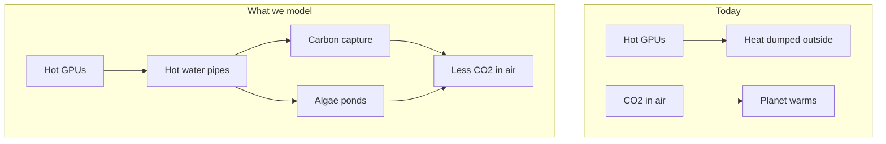

<p align="center">
  <strong>Data Center Heater Side Gig</strong><br>
  <em>Job 1: cool the GPUs. Side gig: use the exhaust before it's thrown away.</em>
</p>

<p align="center">
  <a href="#start-here">Start here</a> ·
  <a href="#the-big-idea">Big idea</a> ·
  <a href="#what-we-found-nvidia-us">Thermal results</a> ·
  <a href="#scalability-charts">Full analysis</a> ·
  <a href="#convection-speculative">Chimney DAC</a> ·
  <a href="#how-the-simulation-works">Methods</a> ·
  <a href="#try-it-yourself">Run it</a> ·
  <a href="#glossary">Glossary</a>
</p>

<p align="center">
  
  
  
  
  
</p>

---

## Start here

> **In one sentence:** Data centers are giant heaters. We quantify **how much exhaust they produce**, **what temperatures are available**, and **which downstream processes can use that heat** before it is dissipated — without assuming a clean grid.

Companies like **NVIDIA** are building huge **data centers** full of powerful **GPUs**. Almost all the electricity they use becomes **waste heat** — usually dumped to ambient. **Data Center Heater Side Gig** simulates routing that exhaust to useful loads:

1. Capture hot water from liquid-cooled GPU loops.
2. Deliver thermal service to **DAC**, **algae**, **pools**, **fisheries**, **shelter showers**, and more.
3. Report **MW**, **GWh/yr**, and **temperature grades** (grid-agnostic). Grid-dependent CO₂ accounting is a separate, labeled scenario.
4. *(Speculative)* Model **chimney convection** — warm exhaust rising through giant CO₂-catching walls, reducing fan power.

Read [The big idea](#the-big-idea), then [Thermal results](#what-we-found-nvidia-us). For the experimental air-side path, see [Chimney DAC](#convection-speculative).

---

## The big idea

### The problem (explained simply)

| What happens today | Why it matters |
|--------------------|----------------|
| GPUs crunch numbers for AI | They use a lot of electricity |
| Almost all that electricity becomes **heat** | Heat has to go somewhere |
| Data centers **cool** the chips with water or air | Then dump the heat outside |
| That heat is **waste** | It does not help anyone — yet |

### The idea we simulate



**Carbon capture (DAC)** — Special materials suck CO₂ out of the air. They need **heat** to “release” and store that CO₂. GPU waste heat can help power that process (often through a **heat pump** that warms the heat up even more).

**Algae ponds** — Tiny plants in water use sunlight to grow. As they grow, they pull CO₂ from the air (same idea as trees, but faster in the right conditions). They grow best at a **steady, warm temperature** — which waste heat can help maintain.

A **robotic controller** in our simulation decides *where* to send the heat: carbon capture, algae, storage, or emergency cooling — similar to how a smart thermostat picks where warmth should go.

### Speculative side path: chimney CO₂ capture

> **Think of it like this:** A data center is already a giant hair dryer. What if that warm air climbed a tall chimney and pulled outdoor air through CO₂-catching sponges — so you need fewer electric fans?

We added a **separate, labeled experiment** for this idea. Warm exhaust creates natural **convection** (like steam rising from soup). Air flows through passive **sorbent** walls. A **heat pump** still wrings the sponge out on a schedule — same regeneration story as liquid DAC. **Nobody has built this at campus scale yet**; our math is a cartoon, not a blueprint. Results are in [Chimney DAC (explain like I'm five)](#convection-speculative).

---

## What we found (NVIDIA U.S.)

**TL;DR:** One **25,000-GPU** hall throws off **~34 MW** of waste heat and can deliver **~71 GWh/yr** of usable thermal service — enough for **~28 million shelter hot showers/year** or colocated DAC/algae. *Grid scenario:* ~38,000 tonnes CO₂/yr net removed.

Full thermal charts, downstream trade-offs, and the grid-dependent carbon appendix are in [Full analysis](#scalability-charts) below. Auto-generated when you run `./gradlew generateFigures`.

For a balanced DAC + algae rotation (one pipe at a time), see [balanced run](#balanced-dac--algae) in [Try it yourself](#try-it-yourself).

**Speculative chimney DAC (reference hall, 120 m tower):** ~**267 m³/s** natural draft, ~**0.08 MW** fan electricity saved, ~**630 tonnes CO₂/yr net** in the grid scenario — see [full plain-English breakdown](#convection-speculative).

---

## GPU reference (representative NVIDIA profiles)

| GPU | Era | System heat per chip | Plain English |
|-----|-----|----------------------|---------------|
| A100 SXM | deployed | ~550 W | ~6 bright light bulbs per chip |
| H100 SXM | deployed | ~950 W | ~10 light bulbs — today's DC standard |
| B200 (liquid) | ramping | ~1,350 W | ~14 light bulbs — our reference hall chip |
| Blackwell Ultra | forecast | ~1,550 W | hotter next-gen Blackwell |
| Vera Rubin Max-P | forecast | ~2,550 W | ~25 light bulbs — liquid-only forecast |

**Reference hall:** **25,000 B200 (liquid) GPUs** ≈ **34 MW** waste heat (`25,000 × 1.35 kW`).

### Hall size sources (why 25k, not 37k)

| Source | What it says |
|--------|----------------|
| [ServeTheHome xAI Colossus tour](https://www.servethehome.com/inside-100000-nvidia-gpu-xai-colossus-cluster-supermicro-helped-build-for-elon-musk/) | **Four ~25,000-GPU compute halls** in the 100k H100 cluster |
| [Introl B200 deployment guide](https://introl.com/blog/nvidia-b200-vs-gb200-deployment-guide) | ~**160–224 GPUs per MW** for B200 HGX (8-GPU racks) |
| [SemiAnalysis GB200 architecture](https://semianalysis.substack.com/p/gb200-hardware-architecture-and-component) | NVL72 rack: **72 GPUs @ ~120 kW** (~1.7 kW/GPU rack power) |

An earlier draft used ~37,000 GPUs (~50 MW). That was internally consistent but **above documented single-hall sizes**. We recalibrated to **25,000 GPUs** to match real U.S. hyperscale halls.

Forecast rows use **public GTC / analyst targets**, not NVIDIA engineering data. See [`config/gpu_profiles.yaml`](config/gpu_profiles.yaml).

### How we explain outputs (thermal first)

| Output | Role |
|--------|------|
| **MW waste heat** | Continuous thermal exhaust (grid-agnostic) |
| **GWh/yr thermal service** | Heat delivered to downstream loads before rejection |
| **Temperature grades** | Which processes can use available heat ([`config/thermal_grades.yaml`](config/thermal_grades.yaml)) |
| **Tonnes CO₂e/year** | *Grid scenario appendix only* — assumes 0.39 kg CO₂/kWh |

Auto-generated analysis is in [Full analysis](#scalability-charts).

---

<a id="scalability-charts"></a>

<!-- SCALABILITY:BEGIN — auto-generated by ./gradlew generateFigures; do not edit -->
## Thermal results: hyperscale waste-heat potential

*Auto-generated **output-side** results for **Data Center Heater Side Gig** — how much heat hyperscale AI halls produce, what temperatures are available, and which downstream processes can use it before dissipation. Grid-dependent carbon accounting is in the [appendix](#appendix-grid-dependent-carbon-scenario).*

### Thesis

> We do not assume clean electricity. We quantify the **output-side thermodynamic potential** of hyperscale AI data centers: how much heat is produced, what temperatures are available, and which downstream processes can use it before it is dissipated.

### Executive summary

> **TL;DR** — One Colossus-class hall throws off **~34 MW** of waste heat and delivers **~71 GWh/yr** of usable thermal service before rejection — enough for **~28 million shelter hot showers/yr** or colocated DAC/algae loads.

#### The question

- Hyperscalers are building **~25,000-GPU liquid-cooled halls** (documented at xAI Colossus)
- Each hall runs **~34 MW of waste heat** 24/7 — usually dumped to ambient
- **What downstream processes** can use that exhaust **before it is wasted**?

#### The answer — reference hall (25k B200)

| | |
|---|---|
| **Waste heat** | **34 MW** continuous exhaust |
| **Thermal service** | **70.9 GWh/yr** delivered to loads |
| **Load split** | DAC **71** · algae **0** · rejected **0 GWh/yr** |
| **Mean delivery temp** | Buffer **53.7°C** · GPU loop **49.9°C** |

#### Downstream equivalents

- ~28.4 million shelter hot showers/yr (~77,718/day)
- **~8,865 homes**-worth of annual heat · details in [Secondary heat applications](#secondary-heat-applications)

#### Grid scenario footnote

If this heat powers DAC on today's U.S. grid: **~37,776 tonnes CO₂e/yr** net removed — see [appendix](#appendix-grid-dependent-carbon-scenario).

### How to read the outputs

| Output | Use for |
|--------|--------|
| **MW waste heat** | Continuous thermal exhaust from GPU operations (grid-agnostic) |
| **GWh/yr thermal service** | Heat actually delivered to downstream loads before rejection |
| **Temperature grades** | Which processes can physically use the available heat |
| **MWh by load** | DAC, algae, pools, fisheries, showers (translation metrics) |
| **Tonnes CO₂e/yr** | *Grid scenario only* — see appendix |

### Reference hall — thermal envelope

**25,000 B200 (liquid) GPUs** · **~34 MW** average waste heat · U.S. Southwest · 7-day sim, annualized

| Output | Reference hall |
|--------|----------------|
| Waste heat | **34 MW** (296 GWh/yr input) |
| Thermal service delivered | **70.9 GWh/yr** |
| Rejected to ambient | **0.1 GWh/yr** |
| Mean buffer temp | **53.7 °C** |
| Mean GPU loop out | **49.9 °C** |
| Mean algae pond | **24.7 °C** |

**Temperature grades** (see `config/thermal_grades.yaml`): GPU loop 40–65°C · buffer 35–55°C · DAC regeneration ~90°C (heat pump) · algae 25–30°C · aquaculture ~22°C · showers ~42°C.

| Source | Finding |
|--------|--------|
| [ServeTheHome / Supermicro](https://www.servethehome.com/inside-100000-nvidia-gpu-xai-colossus-cluster-supermicro-helped-build-for-elon-musk/) | **~25,000 GPUs per compute hall** |
| [Introl B200 guide](https://introl.com/blog/nvidia-b200-vs-gb200-deployment-guide) | **~160–224 GPUs/MW** (B200 HGX) |

### Chart 1 — Thermal service scales with GPU count

*Proportional plant growth*


*Y-axis: thermal service delivered (GWh/yr annualized from simulation)*

**Read:** Each doubling of GPUs (with scaled plant) roughly doubles **GWh/yr delivered** until equipment limits bind.

**Highlighted point:** 25000 GPUs → **49.9 GWh/yr** thermal service at **24 MW** waste heat.

### Chart 2 — Hotter generations, same hall

*Blackwell → Rubin thermal envelope*


*Y-axis: thermal service delivered (GWh/yr annualized from simulation)*

**Read:** Same 25,000-GPU hall delivers more **GWh/yr** as chip TDP rises.

**Highlighted point:** Blackwell Ultra → **81.4 GWh/yr** thermal service at **39 MW** waste heat.

### Chart 3 — Thermal saturation at fixed plant

*Oversized heat, fixed downstream plant*


*Y-axis: thermal service delivered (GWh/yr annualized from simulation)*

**Read:** Pasting more GPUs onto a hall **without** scaling capture plant hits a **thermal service plateau**.

**Highlighted point:** 1.3x heat (31250 GPUs equiv.) → **70.6 GWh/yr** thermal service at **30 MW** waste heat.

### Chart 4 — Multi-hall campus rollout

*NVIDIA-scale campus expansion*


*Y-axis: thermal service delivered (GWh/yr annualized from simulation)*

**Read:** Ten halls ≈ 250k GPUs — cumulative **GWh/yr** scales linearly when each hall is provisioned.

**Highlighted point:** 20 halls → **1418.4 GWh/yr** thermal service at **675 MW** waste heat.

### Chart 5 — Thermal load split (reference hall)


*Stacked annual thermal service by downstream load (DAC priority routing).*

### Chart 6 — Waste heat per GPU by generation


**Input-side thermal envelope** — watts per GPU to the coolant loop (TDP + rack overhead). † = public roadmap forecast. Drives output GWh regardless of grid mix.

<a id="secondary-heat-applications"></a>

### Secondary heat applications — pools, fisheries, showers, community heat

The same **~34 MW** waste-heat stream can be routed to **DAC**, **heated pools**, **aquaculture raceways**, **algae**, or **shelter hot showers** (MVP: one path at a time). Metrics translate delivered MWh into real-world equivalents (olympic pool ~180 MWh/yr; shelter hot shower ~2.5 kWh; U.S. home ~8 MWh/yr heat).

| Priority scenario | Heat (MWh/yr) | Hot showers/yr | Net CO₂e (t/yr, grid) | Olympic pools | Raceways | Homes equiv. |
|-------------------|---------------|----------------|------------------------|---------------|----------|-------------|
| DAC priority (climate) | **70,918** | **28.4M** | 37,776 | 0.0 | 0.0 | 8,865 |
| Community heat (pools + fisheries) | **6,510** | **2.6M** | 1,721 | 0.5 | 0.4 | 814 |
| Algae + DAC balanced | **9,894** | **4.0M** | 3,623 | 0.0 | 0.0 | 1,237 |

*Hot showers: dignified **8-min shelter/mobile unit** shower (~60 L warmed to 42°C, ~2.5 kWh each). Illustrates community heat potential — not a modeled load in the simulator yet.*


**Trade-off (community vs. DAC priority):** ~36,055 fewer tonnes CO₂e removed per year, but **201 MWh/yr** to pools/fisheries and **~814 homes** heat equivalent — a campus **amenity + food + district heat** story alongside partial climate clawback.

- **DAC priority (climate)** — **37,776 tonnes CO₂e/yr** net. Heat delivered: **70,918 MWh/yr** total (pools **0** · fisheries **0** · algae **0** · DAC **70,918**). ≈ **0.0 olympic pools**, **0.0 raceways** (500 m³), **~0 kg fish/yr** potential, **1.7 ha** algae, **~8,865 homes** heat equivalent, **~28.4 million shelter hot showers/yr (~77,718/day)**.
- **Community heat (pools + fisheries)** — **1,721 tonnes CO₂e/yr** net. Heat delivered: **6,510 MWh/yr** total (pools **97** · fisheries **104** · algae **3,409** · DAC **2,900**). ≈ **0.5 olympic pools**, **0.4 raceways** (500 m³), **~5,393 kg fish/yr** potential, **1.7 ha** algae, **~814 homes** heat equivalent, **~2.6 million shelter hot showers/yr (~7,134/day)**.
- **Algae + DAC balanced** — **3,623 tonnes CO₂e/yr** net. Heat delivered: **9,894 MWh/yr** total (pools **0** · fisheries **0** · algae **3,683** · DAC **6,212**). ≈ **0.0 olympic pools**, **0.0 raceways** (500 m³), **~0 kg fish/yr** potential, **2.5 ha** algae, **~1,237 homes** heat equivalent, **~4.0 million shelter hot showers/yr (~10,843/day)**.

### Results at a glance

| Scenario | GPUs | Chip | Halls | **Thermal (GWh/yr)** | Net CO₂e (t/yr, grid scenario) |
|----------|------|------|-------|----------------------|-------------------------------|
| AI lab | 5,000 | H100 SXM | 1 | **10.0** | 5,317 (grid scenario) |
| One hall (H100) | 25,000 | H100 SXM | 1 | **49.9** | 26,583 (grid scenario) |
| One hall (B200) | 25,000 | B200 (liquid) | 1 | **70.9** | 37,776 (grid scenario) |
| 10-hall campus | 25,000 | B200 (liquid) | 1 | **70.9** | 37,776 (grid scenario) |
| Rubin hall | 13,200 | Vera Rubin Max-P | 1 | **70.7** | 37,675 (grid scenario) |

### Scenario narratives

**Lab footprint (~5k H100)** — **10.0 GWh/yr** thermal service at **5 MW** waste heat (DAC **10** · algae **0** · rejected **0 GWh/yr**). Grid scenario: **5,317 tonnes CO₂e/yr** net removed.

**Single Colossus-class hall (25k B200)** — **70.9 GWh/yr** thermal service at **34 MW** waste heat (DAC **71** · algae **0** · rejected **0 GWh/yr**). Grid scenario: **37,776 tonnes CO₂e/yr** net removed.

**Regional campus (10 halls)** — **709.2 GWh/yr** thermal service at **338 MW** waste heat (DAC **709** · algae **0** · rejected **1 GWh/yr**). Grid scenario: **377,760 tonnes CO₂e/yr** net removed.

**Rubin-era hall (forecast)** — **70.7 GWh/yr** thermal service at **34 MW** waste heat (DAC **71** · algae **0** · rejected **0 GWh/yr**). Grid scenario: **37,675 tonnes CO₂e/yr** net removed.

### Conclusion — significance, limits, and what's worth it

> **Verdict:** Routing hyperscale exhaust before dissipation is **worth doing** — **~34 MW** and **~71 GWh/yr** of deliverable thermal service per Colossus-class hall, regardless of whether the grid is coal, gas, solar, nuclear, or geothermal.

#### What is significant

- **34 MW** continuous waste heat — a physical output of compute, not a grid assumption
- **70.9 GWh/yr** thermal service delivered from one hall — DAC, algae, or community loads
- **709 GWh/yr at 10 halls** — campus-scale thermal budget for colocated industry
- **+42% thermal service** H100 → B200 at same 25k footprint — hotter silicon = more output GWh
- **Plant saturation is real** — past ~1.3× heat, GWh delivered barely moves without scaling downstream plant
- **~28.4 million shelter hot showers/yr (~77,718/day)** from the same exhaust — enormous community heat potential

#### What is not significant

- **Debating grid cleanliness to prove heat exists** — the exhaust is there either way
- **National climate salvation from one hall** — see grid appendix for tonne-scale limits
- **Assuming more GPUs automatically add service** — without proportional plant, **GWh plateaus** (Chart 3)
- **Treating CO₂ charts as the primary output** — they are a **labeled grid scenario**, not thermodynamics

#### What's worth it? — decision guide

| If your goal is… | Worth it? | Simulation says… |
|------------------|-----------|------------------|
| Use waste heat before dumping to ambient | **Yes** | **70.9 GWh/yr** deliverable per hall |
| Shelter showers / community heat near campus | **Yes — trade-off** | **~28.4 million shelter hot showers/yr (~77,718/day)** possible; routing choice sets DAC vs. showers |
| Size Blackwell / Rubin halls with matched downstream plant | **Yes** | Hotter generations raise **GWh/hall** when plant scales |
| Prove the hall is carbon-neutral | **No** | Grid scenario still shows net emitter — see appendix |
| Replace national mitigation strategy | **No** | Output story is **per-campus thermodynamics**, not U.S. inventory |

#### Bottom line

**Significant:** tens of MW and tens of GWh/yr of routable exhaust, temperature grades for real downstream loads, and clear saturation lessons for plant sizing. **Not significant:** grid mix as a prerequisite, national CO₂ %, or carbon-neutral claims. **Worth it?** **Yes** to extract value from unavoidable exhaust; climate tonnes are a **separate question** under explicit grid assumptions.

<a id="appendix-grid-dependent-carbon-scenario"></a>

## Appendix: Grid-dependent carbon scenario

> **Assumption:** U.S. grid **0.39 kg CO₂/kWh**, facility **PUE 1.15**. This layer answers *net climate impact* — not whether waste heat exists.

### Operational CO₂ recovery (grid scenario)

For NVIDIA-scale infrastructure, compare DAC removal to **CO₂ from powering the same GPUs** (average waste heat × PUE 1.15 × U.S. grid 0.39 kg/kWh). This stays valid as transport electrifies.

| Scenario | GPU ops CO₂ (t/yr) | DAC net (t/yr) | **Recovery** | Net balance (t/yr) |
|----------|-------------------|-----------------|--------------|-------------------|
| 25k B200 reference | 149,265 | 37,776 | **25%** | -111,489 |
| 25k H100 | 105,038 | 26,583 | **25%** | -78,455 |
| 5k H100 lab | 21,008 | 5,317 | **25%** | -15,691 |
| 10 halls × 25k B200 | 1,492,647 | 377,760 | **25%** | -1,114,887 |

**Reference hall:** Facility draw **~383 GWh/year** (≈ 38 MW IT heat × PUE 1.15). At today's U.S. grid mix (0.39 kg CO₂/kWh), GPU operations emit **149,265 tonnes CO₂e/year**. DAC returns **37,776 tonnes CO₂e/year** — **25% operational recovery**. Still a **net emitter** of **111,489 tonnes CO₂e/year** after DAC — partial clawback, not full offset. As the grid decarbonizes, operational emissions fall but waste heat (and DAC opportunity) remain.

**Strategic framing for NVIDIA:** Waste-heat DAC is **colocated carbon clawback** on heat already paid for — ~one quarter of operational CO₂ today, rising if grid greens and DAC scales with Blackwell/Rubin thermals. Not a license to build; a way to **extract value from unavoidable exhaust**.

#### CO₂ vs. GPU count

*Grid scenario*


*Y-axis: net CO₂e removed (metric tonnes per year, annualized from simulation)*

**Read:** Net tonnes scale with GPUs when plant scales.

**Highlighted point:** 25000 GPUs → **26,583 tonnes CO₂e/year** net removed — **27 thousand tonnes** of **5,000 million tonnes** U.S. annual emissions (~**1 in 188,090**). Roughly **~53,166 acres** of USDA cover-crop program (~119 farms), or **~5,779 cars** gasoline cars / **~13,292 cars** EVs parked for a year.

#### CO₂ vs. GPU generation

*Grid scenario*


*Y-axis: net CO₂e removed (metric tonnes per year, annualized from simulation)*

**Read:** Hotter chips → more net removal at same hall size.

**Highlighted point:** Blackwell Ultra → **43,372 tonnes CO₂e/year** net removed — **43 thousand tonnes** of **5,000 million tonnes** U.S. annual emissions (~**1 in 115,281**). Roughly **~86,745 acres** of USDA cover-crop program (~195 farms), or **~9,429 cars** gasoline cars / **~21,686 cars** EVs parked for a year.

#### CO₂ saturation

*Grid scenario*


*Y-axis: net CO₂e removed (metric tonnes per year, annualized from simulation)*

**Read:** Fixed DAC plant → CO₂ plateau as heat rises.

**Highlighted point:** 1.3x heat (31250 GPUs equiv.) → **37,597 tonnes CO₂e/year** net removed — **38 thousand tonnes** of **5,000 million tonnes** U.S. annual emissions (~**1 in 132,991**). Roughly **~75,193 acres** of USDA cover-crop program (~169 farms), or **~8,173 cars** gasoline cars / **~18,798 cars** EVs parked for a year.

#### CO₂ multi-hall

*Grid scenario*


*Y-axis: net CO₂e removed (metric tonnes per year, annualized from simulation)*

**Read:** Campus-scale cumulative net removal.

**Highlighted point:** 20 halls → **755,519 tonnes CO₂e/year** net removed — **756 thousand tonnes** of **5,000 million tonnes** U.S. annual emissions (~**1 in 6,618**). Roughly **~1,511,038 acres** of USDA cover-crop program (~3396 farms), or **~164,243 cars** gasoline cars / **~377,760 cars** EVs parked for a year.

#### Gross vs. net CO₂ (heat-pump grid penalty)


*Y-axis: net CO₂e removed (metric tonnes per year, annualized from simulation)*

At **50,000 GPUs**: **65,331 tonnes** gross captured vs **53,166 tonnes** net — the gap is grid CO₂ from heat-pump electricity (~19% of gross).

As the U.S. grid decarbonizes, **GPU operational CO₂ falls** but **waste heat remains** — DAC's job is still to use that heat. Gasoline-car analogies (4.6 t/car) overstate the future; EV analogies (2.0 t/car on today's grid) are a better tailpipe mental model. **Tonnes and % recovery** stay the right metrics either way.

### FAQ

**Why lead with GWh, not CO₂?** Waste heat is a **physical output** of compute — it exists whether the grid is coal, gas, solar, nuclear, or geothermal. GWh and temperature grades are grid-agnostic.

**When does grid carbon matter?** When you ask whether DAC **net-removes** CO₂ after heat-pump electricity — see the [grid appendix](#appendix-grid-dependent-carbon-scenario).

**Pools, fisheries, showers vs. DAC?** Same exhaust, different router priority — a **policy choice** about where to send thermal service before dissipation.

### Generated at: 2026-06-05T10:28:04.149527Z

### Sources

- Hall sizing: ServeTheHome xAI Colossus; Introl B200; SemiAnalysis NVL72
- Thermal grades: `config/thermal_grades.yaml`; heat analogies: `config/heat_applications.yaml`
- Grid scenario: U.S. grid 0.39 kg CO₂/kWh, PUE 1.15 (`config/nvidia_us_expansion.yaml`)
- Forecast SKUs: public GTC roadmaps — not NVIDIA confidential data
<!-- SCALABILITY:END -->

---

## How the simulation works

This section is the **method** — how we turned a real-world question into numbers. Written so a motivated high-school student can follow it.

### Step 1 — Build a virtual power plant

We coded a **digital twin** in Java: a simplified copy of pipes, pumps, tanks, and controllers. Every **60 seconds** of simulated time, the computer updates temperatures, flows, and CO₂ totals.


### Step 2 — Physics (the science rules)

We use honest-but-simplified engineering math:

| Rule | What it means | Analogy |
|------|---------------|---------|
| **Heat moves from hot to cold** | GPU loop → heat exchanger → storage tank | Pouring hot tea into a cold mug |
| **Q = ṁ × c × ΔT** | Flow rate × heat capacity × temperature change = power | How much “thermal energy” water carries |
| **Heat exchanger** | Transfers heat without mixing fluids | Two zippered pockets touching — heat crosses, liquids do not |
| **Reject path** | Emergency radiator to ambient | Opening a window when too hot |
| **Safety first** | GPUs must never overheat | Simulation always protects chips before optimizing CO₂ |

### Step 3 — Carbon capture model

1. Hot water from the data center enters a **secondary loop**.
2. A **heat pump** (like an AC unit in reverse) boosts that heat to ~**90 °C**.
3. Hot sorbent material **releases** captured CO₂ for storage.
4. CO₂ captured per second ≈ **heat delivered ÷ energy needed per kg CO₂** (~5.5 MJ/kg in our defaults).

If source water is **below 40 °C**, the heat pump **stalls** — like trying to bake cookies in an oven that never preheated.

### Step 4 — Algae model

Algae growth depends on three knobs we multiply together:

```
growth = surface area × daylight × temperature comfort × CO₂ bonus from DAC
```

| Factor | Intuition |
|--------|-----------|
| **Daylight** | No sun at night → no photosynthesis |
| **Temperature** | Best around **28 °C**; too cold or too hot slows growth |
| **DAC CO₂ bonus** | Bubbling captured CO₂ into ponds can speed growth |

Waste heat **does not replace sunlight**. It **keeps the water warm** so daytime growth stays efficient.

### Step 5 — Climate scorecard

We report:

| Metric | Formula (simplified) |
|--------|----------------------|
| **Gross removal** | DAC kg + algae kg |
| **Electricity penalty** | heat-pump kWh × U.S. grid CO₂ factor (0.39 kg/kWh) |
| **Net CO₂e removed** | gross − penalty |
| **Annualized tonnes** | scale 30-day or 1-year run to 365 days |

> **Important:** “Warming offset in milli-Kelvin” in the output is a **teaching toy**, not a NASA climate model. Trust **net tonnes CO₂e** for the real story.

### Step 6 — What we assume (and what we do not)

| We model | We do not model (yet) |
|----------|----------------------|
| Heat flow, pumps, valves | Real NVIDIA facility blueprints |
| DAC + algae + routing | Storing CO₂ underground |
| 30-day / annualized scaling | Full 365-day weather file per city |
| U.S. average grid emissions | Hour-by-hour grid greenness |
| One load connected at a time | Parallel pipes to all systems |
| *(Speculative)* Chimney convection DAC | CFD, real sorbent chemistry, built campus pilots |

Assumptions are documented in [`config/nvidia_us_expansion.yaml`](config/nvidia_us_expansion.yaml) and [`config/passive_convection_capture.yaml`](config/passive_convection_capture.yaml).

### Step 7 — Speculative chimney convection (optional module)

A separate air-side experiment asks: *can warm exhaust pull air through CO₂-catching walls without as many fans?*

1. Some **reject heat** warms a tall chimney (stack effect — hot air rises).
2. Rising air sucks outdoor air through **sorbent contactors** (adsorb phase, ~8 h).
3. A **heat pump** regenerates the sorbent on a schedule (~2 h) — same liquid-loop story as Step 3.
4. We compare **fan baseline** vs **convection-assisted** fan power and count net CO₂.

Plain-English results: [Chimney DAC](#convection-speculative). Regenerate with `./gradlew generateConvectionFigures`.

---

## Try it yourself

### Prerequisites

- **Java 20+**
- Terminal access

### Quick demo (1 hour of simulated time)

```bash
./gradlew test
./gradlew run --args="--fast"
```

### NVIDIA U.S. expansion (30 simulated days)

```bash
./gradlew run --args="--config config/nvidia_us_expansion.yaml --scenario nvidia_us_module"
```

### Balanced DAC + algae {#balanced-dac--algae}

Rotation between algae and carbon capture (one pipe at a time in this MVP):

```bash
./gradlew run --args="--config config/nvidia_us_algae.yaml --scenario nvidia_us_module"
```

### Speculative convection DAC (30 simulated days)

Passive chimney airflow through CO₂-catching walls — experimental idea, not deployed at scale:

```bash
./gradlew run --args="--config config/nvidia_us_convection.yaml --scenario nvidia_us_module --fast"
```

Regenerate convection charts and kindergarten-level README section:

```bash
./gradlew generateConvectionFigures
```

### Regenerate scalability charts and README results

Runs 7-day sweeps, writes PNGs to `docs/figures/`, updates `docs/results_summary.json`, and patches the [scalability section](#scalability-charts) (LLM if `OPENAI_API_KEY` is set, otherwise template fallback):

```bash
export OPENAI_API_KEY=sk-...   # optional — enables LLM-written explanations
./gradlew generateFigures
```

### What to look for in the output

```
--- CO2 Removal ---
DAC CO2 captured:     ...
Algae CO2 fixed:      ...
Net CO2e removed:     ...

--- Climate Impact (illustrative) ---
Annualized net removal: ... tonnes CO2e/yr
```

---

<a id="convection-speculative"></a>

<!-- CONVECTION:BEGIN — auto-generated by ./gradlew generateConvectionFigures; do not edit -->
## Speculative idea: chimney CO₂ capture (explain like I'm five)

*Auto-generated **speculative** results — passive convection through giant CO₂-catching walls. Not mixed with main thermal results. See [Glossary](#glossary) for simple definitions.*

> **In one sentence:** Warm exhaust rises like a chimney and drags air through CO₂-catching walls — so we need fewer electric fans.

### Picture this

| Complicated word | Think of it like… |
|------------------|-------------------|
| Waste heat | Computers get hot like a game console — that warmth is waste heat. |
| Regeneration | Heating the sponge to squeeze the CO₂ out, like wringing a towel. |
| Convection / chimney | Hot air rises like steam from soup — it pulls more air along. |
| CO₂ capture sponge | A sponge in the air that grabs CO₂ molecules. |
| Fans | The chimney does part of the leaf-blower's job. |

### What the simulation tried (still experimental in real life)

1. GPUs make heat → some goes into a tall warm chimney
2. Rising warm air sucks outdoor air through giant capture walls
3. Sponges fill up → heat pump squeezes CO₂ out (same as our liquid DAC model)
4. Count CO₂ caught, fans saved, electricity still needed

### Results in plain English

| Question a kid might ask | What we found |
|--------------------------|---------------|
| Is the data center a heater? | Yes. Almost all the electricity becomes heat. |
| Why a tall tower? | Taller warm column = stronger upward pull. |
| Do we still need fans? | Usually yes, but smaller or weaker ones. |
| Do we still need hot water for the sponge? | Yes — catching is passive; squeezing still needs heat. |
| Did we build this for real? | No. This is a computer experiment only. |
| How much air does the chimney pull? | About **267 m³/s** at our reference size |
| How much fan electricity do we save? | About **0.08 MW** vs. fan-only baseline |
| How much CO₂ per year (computer guess)? | **630 tonnes net** after electricity penalty |

### Then the numbers

**Reference hall** (~40 MW waste heat, 120 m chimney, 50000 m² contactors):

| Metric | Value |
|--------|-------|
| Airflow | **267 m³/s** |
| Exhaust ΔT | **42.9 K** above ambient |
| Fan baseline | **0.08 MW** |
| Fan with convection | **0.00 MW** |
| Fan saved | **0.08 MW** |
| Gross CO₂ captured | **774 t/yr** |
| Net CO₂ (grid scenario) | **630 t/yr** |


### Honest limits

- Nobody runs this at campus scale yet
- Our math is a cartoon, not a blueprint
- Liquid-cooled halls may need extra steps to warm the air chimney
- Speculative — physics is plausible, real plants are not built yet. Computer experiment only.

### Generated at: 2026-06-05T10:28:09.352120Z

### Sources

- Physics: lumped buoyancy + porous-bed resistance (`src/main/java/com/heater/carbon/ConvectionCapturePhysics.java`)
- Defaults: `config/passive_convection_capture.yaml`
- Analogies: `config/convection_analogies.yaml`
- Speculative — physics is plausible, real plants are not built yet. Computer experiment only.
<!-- CONVECTION:END -->

---

## Project map

```
datacenter-heater-sidegig/
├── README.md                          ← you are here
├── config/
│   ├── default.yaml                   demo / classroom scale
│   ├── nvidia_us_expansion.yaml       50 MW U.S. hall (DAC priority)
│   ├── nvidia_us_algae.yaml           50 MW hall (rotation)
│   ├── nvidia_us_convection.yaml      speculative chimney DAC
│   ├── passive_convection_capture.yaml  convection defaults
│   ├── convection_sweep.yaml          convection sweep parameters
│   ├── convection_analogies.yaml      kindergarten explainers
│   ├── gpu_profiles.yaml              NVIDIA SKU thermal profiles
│   └── scalability_sweep.yaml         sweep parameters for figures
├── docs/
│   ├── figures/                       scalability + convection PNGs
│   ├── results_summary.json           machine-readable thermal sweep output
│   └── convection_summary.json        speculative chimney DAC sweep output
└── src/main/java/com/heater/
    ├── App.java                       CLI
    ├── analysis/                      sweeps, charts, README explainer
    ├── thermal/                       heat exchangers, simulator
    ├── carbon/                        DAC, algae, climate math
    ├── control/                       safety + automation
    └── robot/                         load routing
```

---

## Glossary

| Term | Simple definition |
|------|-------------------|
| **GPU** | Graphics Processing Unit — a chip that does parallel math; used heavily for AI |
| **Data center** | A building full of computers |
| **Waste heat** | Unwanted thermal energy left over after electricity does work |
| **CO₂ / CO₂e** | Carbon dioxide (and “equivalent” gases) — greenhouse gases |
| **DAC** | Direct Air Capture — technology that filters CO₂ from ambient air |
| **Heat pump** | Device that moves heat uphill from cool to hot (uses electricity) |
| **Algae bioreactor** | Controlled pond or tank growing algae for CO₂ uptake |
| **Megawatt (MW)** | One million watts — a measure of power |
| **Tonne** | 1,000 kg — used for CO₂ mass (1 tonne ≈ 2,204 lbs) |
| **Simulation** | A computer experiment that mimics reality with math |
| **Net removal** | CO₂ pulled out minus CO₂ emitted to run equipment |
| **Convection** | Warm air rises and cooler air moves in to take its place |
| **Chimney effect** | Using rising warm air to pull air through a tube or tower |
| **Sorbent** | A material that temporarily holds onto CO₂ from passing air |
| **Air contactor** | The big wall or tower where air meets the sorbent |

---

## For teachers and reviewers

### Learning goals

Students engaging with this repo can practice:

- Connecting **energy**, **heat transfer**, and **climate** in one story
- Reading **quantitative results** with appropriate skepticism
- Understanding **tradeoffs** (electricity penalty vs. thermal benefit)
- Seeing how **engineering models** simplify reality on purpose

### Suggested discussion questions

1. Why does the heat pump’s electricity use **reduce** net climate benefit?
2. Why is algae growth **zero at night** in the model?
3. If NVIDIA builds **twice** as many GPUs, does CO₂ removal **double** forever? Why not?
4. What would you add to make this simulation more fair or more realistic?

### Technical stack

| Layer | Choice |
|-------|--------|
| Language | Java 20+ (primitive `double` hot loop, records for snapshots) |
| Build | Gradle 8.7 |
| Config | YAML (SnakeYAML) |
| Tests | JUnit 5 |
| Charts | XChart (`./gradlew generateFigures`) |

### Mapping simulation → real hardware

| In code | In the real world |
|---------|-------------------|
| `ccsValveOpen` | Valve to the carbon capture plant |
| `algaeValveOpen` | Valve to algae pond heaters |
| `RoboticRouter` | Automated pipe manifold or robot coupler |
| `q_waste` | Live data from GPU power and coolant sensors |

---

## Honest limitations

1. **Not official NVIDIA data** — inspired by public hyperscale scales, not internal engineering.
2. **One pipe at a time** — real sites would run multiple loops in parallel.
3. **Climate “mK offset”** — illustrative only.
4. **Algae economics** — we count CO₂ in biomass, not fuel sales or food products.
5. **Safety** — real plants need physical fail-safes beyond software.

---

## License & contribution

This is an educational simulation project. Run tests before changing physics or safety code:

```bash
./gradlew test
```

---

<p align="center">
  <strong>Every data center is a heater.</strong><br>
  This project gives that heat a side gig.
</p>

<p align="center">
  <sub>Data Center Heater Side Gig · simulation only — not engineering advice for live data centers.</sub>
</p>
