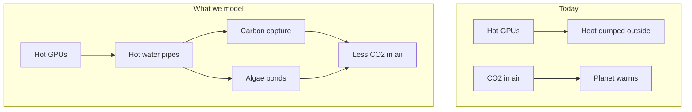

<p align="center">
  <strong>Data Center Heater Side Gig</strong><br>
  <em>Job 1: cool the GPUs. Side gig: pull CO₂ from the air.</em>
</p>

<p align="center">
  <a href="#start-here">Start here</a> ·
  <a href="#the-big-idea">Big idea</a> ·
  <a href="#what-we-found-nvidia-us">NVIDIA results</a> ·
  <a href="#scalability-charts">Scalability</a> ·
  <a href="#how-the-simulation-works">Methods</a> ·
  <a href="#try-it-yourself">Run it</a> ·
  <a href="#glossary">Glossary</a>
</p>

<p align="center">
  
  
  
  
  
</p>

---

## Start here

> **In one sentence:** Data centers are giant heaters. What if that heat had a **side gig** — removing CO₂ from the atmosphere instead of only warming the planet?

Companies like **NVIDIA** are building huge **data centers** full of powerful **GPUs** (the chips that train AI). Those chips get **hot**. Cooling them produces **waste heat** — the data center’s unwanted “heater” output. Today, most of that heat is thrown away.

**Data Center Heater Side Gig** is a **computer simulation** of a smarter second job for that heat:

1. Capture the hot water cooling the GPUs.
2. Use that heat to run **carbon capture** machines and **algae ponds**.
3. Measure how much CO₂ is removed — and whether it actually helps the climate after you pay for electricity.

Read [The big idea](#the-big-idea) first, then [What we found](#what-we-found-nvidia-us).

---

## The big idea

### The problem (explained simply)

| What happens today | Why it matters |
|--------------------|----------------|
| GPUs crunch numbers for AI | They use a lot of electricity |
| Almost all that electricity becomes **heat** | Heat has to go somewhere |
| Data centers **cool** the chips with water or air | Then dump the heat outside |
| That heat is **waste** | It does not help anyone |

At the same time, Earth has **too much CO₂** in the atmosphere from burning fossil fuels. CO₂ acts like a blanket and traps heat — that is the main driver of **global warming**.

### The idea we simulate



**Carbon capture (DAC)** — Special materials suck CO₂ out of the air. They need **heat** to “release” and store that CO₂. GPU waste heat can help power that process (often through a **heat pump** that warms the heat up even more).

**Algae ponds** — Tiny plants in water use sunlight to grow. As they grow, they pull CO₂ from the air (same idea as trees, but faster in the right conditions). They grow best at a **steady, warm temperature** — which waste heat can help maintain.

A **robotic controller** in our simulation decides *where* to send the heat: carbon capture, algae, storage, or emergency cooling — similar to how a smart thermostat picks where warmth should go.

---

## What we found (NVIDIA U.S.)

We ran the simulator for **one liquid-cooled U.S. AI hall** (~**25,000 GPUs**, ~34 MW waste heat on B200 liquid, DAC priority). Charts report **tonnes CO₂e/year**; prose adds scale analogies (agriculture, transport, **% operational recovery**, and **secondary heat** — olympic pools, aquaculture raceways, homes heated). See [Scalability](#scalability-charts).

**Full scalability analysis** — GPU counts, generation comparisons, campus rollout, and charts — is in [Scalability: GPUs, heat, and CO₂](#scalability-charts) below. Those numbers are **auto-generated** when you run `./gradlew generateFigures`.

For a balanced DAC + algae rotation (one pipe at a time), see [balanced run](#balanced-dac--algae) in [Try it yourself](#try-it-yourself).

---

## GPU reference (representative NVIDIA profiles)

| GPU | Era | System heat per chip | Plain English |
|-----|-----|----------------------|---------------|
| A100 SXM | deployed | ~550 W | ~6 bright light bulbs per chip |
| H100 SXM | deployed | ~950 W | ~10 light bulbs — today's DC standard |
| B200 (liquid) | ramping | ~1,350 W | ~14 light bulbs — our reference hall chip |
| Blackwell Ultra | forecast | ~1,550 W | hotter next-gen Blackwell |
| Vera Rubin Max-P | forecast | ~2,550 W | ~25 light bulbs — liquid-only forecast |

**Reference hall:** **25,000 B200 (liquid) GPUs** ≈ **34 MW** waste heat (`25,000 × 1.35 kW`).

### Hall size sources (why 25k, not 37k)

| Source | What it says |
|--------|----------------|
| [ServeTheHome xAI Colossus tour](https://www.servethehome.com/inside-100000-nvidia-gpu-xai-colossus-cluster-supermicro-helped-build-for-elon-musk/) | **Four ~25,000-GPU compute halls** in the 100k H100 cluster |
| [Introl B200 deployment guide](https://introl.com/blog/nvidia-b200-vs-gb200-deployment-guide) | ~**160–224 GPUs per MW** for B200 HGX (8-GPU racks) |
| [SemiAnalysis GB200 architecture](https://semianalysis.substack.com/p/gb200-hardware-architecture-and-component) | NVL72 rack: **72 GPUs @ ~120 kW** (~1.7 kW/GPU rack power) |

An earlier draft used ~37,000 GPUs (~50 MW). That was internally consistent but **above documented single-hall sizes**. We recalibrated to **25,000 GPUs** to match real U.S. hyperscale halls.

Forecast rows use **public GTC / analyst targets**, not NVIDIA engineering data. See [`config/gpu_profiles.yaml`](config/gpu_profiles.yaml).

### How we explain scale (charts stay in tonnes)

| Metric | Role |
|--------|------|
| **Tonnes CO₂e/year** | Primary unit on all charts |
| **% operational recovery** | DAC net ÷ GPU grid CO₂ — the fair “worth it?” test |
| **Cover-crop acres** | USDA-style soil carbon (~0.5 t/acre/yr) |
| **Gasoline / EV cars** | Legacy transport intuition — **less meaningful as grids electrify** |

See [`config/impact_analogies.yaml`](config/impact_analogies.yaml). Auto-generated narratives are in [Scalability](#scalability-charts).

---

<a id="scalability-charts"></a>

<!-- SCALABILITY:BEGIN — auto-generated by ./gradlew generateFigures; do not edit -->
## Scalability: GPUs, heat, and CO₂

*Auto-generated simulation results for **Data Center Heater Side Gig** — waste-heat-driven DAC at NVIDIA-scale U.S. AI halls. Charts use **metric tonnes CO₂e/year**; prose adds scale analogies.*

### Executive summary

NVIDIA and hyperscale partners are building **~25,000-GPU liquid-cooled halls** (documented at xAI Colossus). Each hall throws off **tens of MW of waste heat** 24/7. This simulation asks: if that heat powers **direct air capture (DAC)** colocated on campus, how much CO₂ comes back out of the atmosphere — and what fraction of the **hall's own GPU electricity emissions** does that recuperate?

**Reference answer (25k B200 liquid, DAC priority):** 37,776 tonnes CO₂e/year net removed; **25% recovery** of operational GPU-grid CO₂. **37,776 tonnes CO₂e per year** net removed. Scale: **0.001%** of U.S. emissions, **0.01%** of U.S. agriculture sector emissions, **0.0001%** of global anthropogenic CO₂. Transport intuition (declining relevance as grids electrify): equivalent to **~8,212 cars** gasoline cars parked for a year, or **~18,888 cars** EVs on today's U.S. grid. Agriculture intuition: like running a **cover-crop carbon program on ~75,552 acres** (~170 average-sized U.S. farms at ~445 acres each). Also **~4,444 homes'** annual energy emissions, or **~37,776** NYC–London round-trip flights.

### How to read the metrics

| Metric | Use for |
|--------|--------|
| **Tonnes CO₂e/year** | Engineering, reporting, charts — the primary unit |
| **% operational recovery** | Fair "worth it?" test vs. the hall's own GPU grid emissions |
| **Cars / farms / homes** | Intuition only — see electrification note below |

As the U.S. grid decarbonizes, **GPU operational CO₂ falls** but **waste heat remains** — DAC's job is still to use that heat. Gasoline-car analogies (4.6 t/car) overstate the future; EV analogies (2.0 t/car on today's grid) are a better tailpipe mental model. **Tonnes and % recovery** stay the right metrics either way.

### Reference hall — scale and sources

**25,000 B200 (liquid) GPUs** · **~34 MW** average waste heat · U.S. Southwest climate · 7-day sim, annualized

| Source | Finding |
|--------|--------|
| [ServeTheHome / Supermicro](https://www.servethehome.com/inside-100000-nvidia-gpu-xai-colossus-cluster-supermicro-helped-build-for-elon-musk/) | **~25,000 GPUs per compute hall** (4 halls → 100k H100) |
| [Introl B200 guide](https://introl.com/blog/nvidia-b200-vs-gb200-deployment-guide) | **~160–224 GPUs/MW** (B200 HGX, 8-GPU racks) |
| [SemiAnalysis NVL72](https://semianalysis.substack.com/p/gb200-hardware-architecture-and-component) | **72 GPUs @ ~120 kW/rack** |

### Chart 1 — Removal scales with GPU count

*Proportional plant growth*


*Y-axis: net CO₂e removed (metric tonnes per year, annualized from simulation)*

**Read:** Each doubling of GPUs (with scaled DAC) roughly doubles net removal until equipment limits bind.

**Highlighted point:** 25000 GPUs → **26,583 tonnes CO₂e per year** net removed. Scale: **0.001%** of U.S. emissions, **0.00%** of U.S. agriculture sector emissions, **0.0001%** of global anthropogenic CO₂. Transport intuition (declining relevance as grids electrify): equivalent to **~5,779 cars** gasoline cars parked for a year, or **~13,292 cars** EVs on today's U.S. grid. Agriculture intuition: like running a **cover-crop carbon program on ~53,166 acres** (~119 average-sized U.S. farms at ~445 acres each). Also **~3,127 homes'** annual energy emissions, or **~26,583** NYC–London round-trip flights.

### Chart 2 — Hotter generations, same hall

*Blackwell → Rubin thermal envelope*


*Y-axis: net CO₂e removed (metric tonnes per year, annualized from simulation)*

**Read:** Same 25,000-GPU hall removes more CO₂ as TDP rises — relevant for Blackwell and Vera Rubin planning.

**Highlighted point:** Blackwell Ultra → **43,372 tonnes CO₂e per year** net removed. Scale: **0.001%** of U.S. emissions, **0.01%** of U.S. agriculture sector emissions, **0.0001%** of global anthropogenic CO₂. Transport intuition (declining relevance as grids electrify): equivalent to **~9,429 cars** gasoline cars parked for a year, or **~21,686 cars** EVs on today's U.S. grid. Agriculture intuition: like running a **cover-crop carbon program on ~86,745 acres** (~195 average-sized U.S. farms at ~445 acres each). Also **~5,103 homes'** annual energy emissions, or **~43,372** NYC–London round-trip flights.

### Chart 3 — Saturation at fixed DAC capacity

*Oversized heat, fixed capture plant*


*Y-axis: net CO₂e removed (metric tonnes per year, annualized from simulation)*

**Read:** Pasting more GPUs onto a hall **without** scaling DAC hits a plateau — capex must match heat.

**Highlighted point:** 1.3x heat (31250 GPUs equiv.) → **37,597 tonnes CO₂e per year** net removed. Scale: **0.001%** of U.S. emissions, **0.01%** of U.S. agriculture sector emissions, **0.0001%** of global anthropogenic CO₂. Transport intuition (declining relevance as grids electrify): equivalent to **~8,173 cars** gasoline cars parked for a year, or **~18,798 cars** EVs on today's U.S. grid. Agriculture intuition: like running a **cover-crop carbon program on ~75,193 acres** (~169 average-sized U.S. farms at ~445 acres each). Also **~4,423 homes'** annual energy emissions, or **~37,597** NYC–London round-trip flights.

### Chart 4 — Multi-hall campus rollout

*NVIDIA-scale campus expansion*


*Y-axis: net CO₂e removed (metric tonnes per year, annualized from simulation)*

**Read:** Ten halls ≈ 250k GPUs — where regional climate impact becomes policy-visible.

**Highlighted point:** 20 halls → **755,519 tonnes CO₂e per year** net removed. Scale: **0.015%** of U.S. emissions, **0.13%** of U.S. agriculture sector emissions, **0.0021%** of global anthropogenic CO₂. Transport intuition (declining relevance as grids electrify): equivalent to **~164,243 cars** gasoline cars parked for a year, or **~377,760 cars** EVs on today's U.S. grid. Agriculture intuition: like running a **cover-crop carbon program on ~1,511,038 acres** (~3396 average-sized U.S. farms at ~445 acres each). Also **~88,885 homes'** annual energy emissions, or **~755,519** NYC–London round-trip flights.

### Chart 5 — Gross vs. net (heat-pump electricity penalty)


*Y-axis: net CO₂e removed (metric tonnes per year, annualized from simulation)*

At **50,000 GPUs**: **65,331 tonnes** gross captured vs **53,166 tonnes** net — the gap is grid CO₂ from heat-pump electricity (~19% of gross).

### Chart 6 — Waste heat per GPU by generation


Watts per GPU to the coolant loop (TDP + rack overhead). † = public roadmap forecast.

### Operational CO₂ recovery — the primary "worth it?" metric

For NVIDIA-scale infrastructure, compare DAC removal to **CO₂ from powering the same GPUs** (average waste heat × PUE 1.15 × U.S. grid 0.39 kg/kWh). This stays valid as transport electrifies.

| Scenario | GPU ops CO₂ (t/yr) | DAC net (t/yr) | **Recovery** | Net balance (t/yr) |
|----------|-------------------|-----------------|--------------|-------------------|
| 25k B200 reference | 149,265 | 37,776 | **25%** | -111,489 |
| 25k H100 | 105,038 | 26,583 | **25%** | -78,455 |
| 5k H100 lab | 21,008 | 5,317 | **25%** | -15,691 |
| 10 halls × 25k B200 | 1,492,647 | 377,760 | **25%** | -1,114,887 |

**Reference hall:** Facility draw **~383 GWh/year** (≈ 38 MW IT heat × PUE 1.15). At today's U.S. grid mix (0.39 kg CO₂/kWh), GPU operations emit **149,265 tonnes CO₂e/year**. DAC returns **37,776 tonnes CO₂e/year** — **25% operational recovery**. Still a **net emitter** of **111,489 tonnes CO₂e/year** after DAC — partial clawback, not full offset. As the grid decarbonizes, operational emissions fall but waste heat (and DAC opportunity) remain.

**Strategic framing for NVIDIA:** Waste-heat DAC is **colocated carbon clawback** on heat already paid for — ~one quarter of operational CO₂ today, rising if grid greens and DAC scales with Blackwell/Rubin thermals. Not a license to build; a way to **extract value from unavoidable exhaust**.

### Secondary heat applications — pools, fisheries, community heat

The same **~34 MW** waste-heat stream can be routed to **DAC**, **heated pools**, **aquaculture raceways**, or **algae** (MVP: one path at a time). Metrics translate delivered MWh into real-world equivalents (olympic pool ~180 MWh/yr; community pool ~45 MWh/yr; 500 m³ raceway ~241 MWh/yr maintenance; U.S. home ~8 MWh/yr heat).

| Priority scenario | Net CO₂e (t/yr) | Heat delivered (MWh/yr) | Olympic pools | Raceways (500 m³) | Fish potential (kg/yr) | Homes equiv. |
|-------------------|-----------------|---------------------------|---------------|-------------------|--------------------------|-------------|
| DAC priority (climate) | **37,776** | 70,918 | 0.0 | 0.0 | 0 | 8,865 |
| Community heat (pools + fisheries) | **1,721** | 6,510 | 0.5 | 0.4 | 5,393 | 814 |
| Algae + DAC balanced | **3,623** | 9,894 | 0.0 | 0.0 | 0 | 1,237 |

**Trade-off (community vs. DAC priority):** ~36,055 fewer tonnes CO₂e removed per year, but **201 MWh/yr** to pools/fisheries and **~814 homes** heat equivalent — a campus **amenity + food + district heat** story alongside partial climate clawback.

- **DAC priority (climate)** — **37,776 tonnes CO₂e/yr** net. Heat delivered: **70,918 MWh/yr** total (pools **0** · fisheries **0** · algae **0** · DAC **70,918**). ≈ **0.0 olympic pools**, **0.0 raceways** (500 m³), **~0 kg fish/yr** potential, **1.7 ha** algae, **~8,865 homes** heat equivalent.
- **Community heat (pools + fisheries)** — **1,721 tonnes CO₂e/yr** net. Heat delivered: **6,510 MWh/yr** total (pools **97** · fisheries **104** · algae **3,409** · DAC **2,900**). ≈ **0.5 olympic pools**, **0.4 raceways** (500 m³), **~5,393 kg fish/yr** potential, **1.7 ha** algae, **~814 homes** heat equivalent.
- **Algae + DAC balanced** — **3,623 tonnes CO₂e/yr** net. Heat delivered: **9,894 MWh/yr** total (pools **0** · fisheries **0** · algae **3,683** · DAC **6,212**). ≈ **0.0 olympic pools**, **0.0 raceways** (500 m³), **~0 kg fish/yr** potential, **2.5 ha** algae, **~1,237 homes** heat equivalent.

### Results at a glance

| Scenario | GPUs | Chip | Halls | **Net CO₂e (t/yr)** | Scale intuition |
|----------|------|------|-------|---------------------|------------------|
| AI lab | 5,000 | H100 SXM | 1 | **5,317** | ~10,633 acres cover-crop equiv.; ~1,156 cars gasoline cars (legacy proxy) |
| One hall (H100) | 25,000 | H100 SXM | 1 | **26,583** | ~53,166 acres cover-crop equiv.; ~5,779 cars gasoline cars (legacy proxy) |
| One hall (B200) | 25,000 | B200 (liquid) | 1 | **37,776** | ~75,552 acres cover-crop equiv.; ~8,212 cars gasoline cars (legacy proxy) |
| 10-hall campus | 25,000 | B200 (liquid) | 10 | **377,760** | ~755,519 acres cover-crop equiv.; ~82,122 cars gasoline cars (legacy proxy) |
| Rubin hall | 13,200 | Vera Rubin Max-P | 1 | **37,675** | ~75,350 acres cover-crop equiv.; ~8,190 cars gasoline cars (legacy proxy) |

### Scenario narratives

**Lab footprint (~5k H100)** — **5,317 tonnes CO₂e per year** net removed. Scale: **0.000%** of U.S. emissions, **0.00%** of U.S. agriculture sector emissions, **0.0000%** of global anthropogenic CO₂. Transport intuition (declining relevance as grids electrify): equivalent to **~1,156 cars** gasoline cars parked for a year, or **~2,658 cars** EVs on today's U.S. grid. Agriculture intuition: like running a **cover-crop carbon program on ~10,633 acres** (~24 average-sized U.S. farms at ~445 acres each). Also **~625 homes'** annual energy emissions, or **~5,317** NYC–London round-trip flights. *(MVP: single heat path; parallel DAC+algae would raise totals.)*

**Single Colossus-class hall (25k B200)** — **37,776 tonnes CO₂e per year** net removed. Scale: **0.001%** of U.S. emissions, **0.01%** of U.S. agriculture sector emissions, **0.0001%** of global anthropogenic CO₂. Transport intuition (declining relevance as grids electrify): equivalent to **~8,212 cars** gasoline cars parked for a year, or **~18,888 cars** EVs on today's U.S. grid. Agriculture intuition: like running a **cover-crop carbon program on ~75,552 acres** (~170 average-sized U.S. farms at ~445 acres each). Also **~4,444 homes'** annual energy emissions, or **~37,776** NYC–London round-trip flights. *(MVP: single heat path; parallel DAC+algae would raise totals.)*

**Regional campus (10 halls)** — **377,760 tonnes CO₂e per year** net removed. Scale: **0.008%** of U.S. emissions, **0.06%** of U.S. agriculture sector emissions, **0.0010%** of global anthropogenic CO₂. Transport intuition (declining relevance as grids electrify): equivalent to **~82,122 cars** gasoline cars parked for a year, or **~188,880 cars** EVs on today's U.S. grid. Agriculture intuition: like running a **cover-crop carbon program on ~755,519 acres** (~1698 average-sized U.S. farms at ~445 acres each). Also **~44,442 homes'** annual energy emissions, or **~377,760** NYC–London round-trip flights. *(MVP: single heat path; parallel DAC+algae would raise totals.)*

**Rubin-era hall (forecast)** — **37,675 tonnes CO₂e per year** net removed. Scale: **0.001%** of U.S. emissions, **0.01%** of U.S. agriculture sector emissions, **0.0001%** of global anthropogenic CO₂. Transport intuition (declining relevance as grids electrify): equivalent to **~8,190 cars** gasoline cars parked for a year, or **~18,838 cars** EVs on today's U.S. grid. Agriculture intuition: like running a **cover-crop carbon program on ~75,350 acres** (~169 average-sized U.S. farms at ~445 acres each). Also **~4,432 homes'** annual energy emissions, or **~37,675** NYC–London round-trip flights. *(MVP: single heat path; parallel DAC+algae would raise totals.)*

### FAQ

**Why tonnes on charts, not cars?** Tonnes are the engineering and reporting unit. Cars are a fading proxy as transport electrifies — we keep them in prose with an EV caveat.

**What is the right "worth it?" metric?** **% operational recovery** — how much of the hall's own GPU-grid CO₂ DAC gives back. Not global cars off the road.

**Does a greener grid hurt this story?** GPU **operational** CO₂ drops; **waste heat** does not. DAC becomes *more* valuable per MWh of heat, but heat-pump electricity penalty also shrinks.

**Agriculture comparison — serious or gimmick?** USDA cover-crop programs sequester **~0.3–0.8 t CO₂e/acre/year**. Our reference hall matches **~75,000 acres** of high-performing cover crop — real land programs, not a substitute for cutting GPU power.

**NVIDIA-specific takeaway:** Blackwell and Rubin halls run hotter → **more DAC potential per hall** if capture plant scales with silicon. Saturation chart shows **DAC capex must track heat**.

**Pools and fisheries vs. DAC?** Same waste heat, different router priority. Community scenarios trade some CO₂ removal for **pools, raceway aquaculture, and district-heat equivalents** — see Secondary heat applications above.

### Generated at: 2026-06-05T09:22:20.278772Z

### Sources

- Hall sizing: ServeTheHome xAI Colossus; Introl B200; SemiAnalysis NVL72
- Analogies: EPA (transport, national inventory), USDA NRCS (cover crops), EIA (homes)
- Forecast SKUs: public GTC roadmaps — not NVIDIA confidential data
<!-- SCALABILITY:END -->

---

## How the simulation works

This section is the **method** — how we turned a real-world question into numbers. Written so a motivated high-school student can follow it.

### Step 1 — Build a virtual power plant

We coded a **digital twin** in Java: a simplified copy of pipes, pumps, tanks, and controllers. Every **60 seconds** of simulated time, the computer updates temperatures, flows, and CO₂ totals.


### Step 2 — Physics (the science rules)

We use honest-but-simplified engineering math:

| Rule | What it means | Analogy |
|------|---------------|---------|
| **Heat moves from hot to cold** | GPU loop → heat exchanger → storage tank | Pouring hot tea into a cold mug |
| **Q = ṁ × c × ΔT** | Flow rate × heat capacity × temperature change = power | How much “thermal energy” water carries |
| **Heat exchanger** | Transfers heat without mixing fluids | Two zippered pockets touching — heat crosses, liquids do not |
| **Reject path** | Emergency radiator to ambient | Opening a window when too hot |
| **Safety first** | GPUs must never overheat | Simulation always protects chips before optimizing CO₂ |

### Step 3 — Carbon capture model

1. Hot water from the data center enters a **secondary loop**.
2. A **heat pump** (like an AC unit in reverse) boosts that heat to ~**90 °C**.
3. Hot sorbent material **releases** captured CO₂ for storage.
4. CO₂ captured per second ≈ **heat delivered ÷ energy needed per kg CO₂** (~5.5 MJ/kg in our defaults).

If source water is **below 40 °C**, the heat pump **stalls** — like trying to bake cookies in an oven that never preheated.

### Step 4 — Algae model

Algae growth depends on three knobs we multiply together:

```
growth = surface area × daylight × temperature comfort × CO₂ bonus from DAC
```

| Factor | Intuition |
|--------|-----------|
| **Daylight** | No sun at night → no photosynthesis |
| **Temperature** | Best around **28 °C**; too cold or too hot slows growth |
| **DAC CO₂ bonus** | Bubbling captured CO₂ into ponds can speed growth |

Waste heat **does not replace sunlight**. It **keeps the water warm** so daytime growth stays efficient.

### Step 5 — Climate scorecard

We report:

| Metric | Formula (simplified) |
|--------|----------------------|
| **Gross removal** | DAC kg + algae kg |
| **Electricity penalty** | heat-pump kWh × U.S. grid CO₂ factor (0.39 kg/kWh) |
| **Net CO₂e removed** | gross − penalty |
| **Annualized tonnes** | scale 30-day or 1-year run to 365 days |

> **Important:** “Warming offset in milli-Kelvin” in the output is a **teaching toy**, not a NASA climate model. Trust **net tonnes CO₂e** for the real story.

### Step 6 — What we assume (and what we do not)

| We model | We do not model (yet) |
|----------|----------------------|
| Heat flow, pumps, valves | Real NVIDIA facility blueprints |
| DAC + algae + routing | Storing CO₂ underground |
| 30-day / annualized scaling | Full 365-day weather file per city |
| U.S. average grid emissions | Hour-by-hour grid greenness |
| One load connected at a time | Parallel pipes to all systems |

Assumptions are documented in [`config/nvidia_us_expansion.yaml`](config/nvidia_us_expansion.yaml).

---

## Try it yourself

### Prerequisites

- **Java 20+**
- Terminal access

### Quick demo (1 hour of simulated time)

```bash
./gradlew test
./gradlew run --args="--fast"
```

### NVIDIA U.S. expansion (30 simulated days)

```bash
./gradlew run --args="--config config/nvidia_us_expansion.yaml --scenario nvidia_us_module"
```

### Balanced DAC + algae {#balanced-dac--algae}

Rotation between algae and carbon capture (one pipe at a time in this MVP):

```bash
./gradlew run --args="--config config/nvidia_us_algae.yaml --scenario nvidia_us_module"
```

### Regenerate scalability charts and README results

Runs 7-day sweeps, writes PNGs to `docs/figures/`, updates `docs/results_summary.json`, and patches the [scalability section](#scalability-charts) (LLM if `OPENAI_API_KEY` is set, otherwise template fallback):

```bash
export OPENAI_API_KEY=sk-...   # optional — enables LLM-written explanations
./gradlew generateFigures
```

### What to look for in the output

```
--- CO2 Removal ---
DAC CO2 captured:     ...
Algae CO2 fixed:      ...
Net CO2e removed:     ...

--- Climate Impact (illustrative) ---
Annualized net removal: ... tonnes CO2e/yr
```

---

## Project map

```
datacenter-heater-sidegig/
├── README.md                          ← you are here
├── config/
│   ├── default.yaml                   demo / classroom scale
│   ├── nvidia_us_expansion.yaml       50 MW U.S. hall (DAC priority)
│   ├── nvidia_us_algae.yaml           50 MW hall (rotation)
│   ├── gpu_profiles.yaml              NVIDIA SKU thermal profiles
│   └── scalability_sweep.yaml         sweep parameters for figures
├── docs/
│   ├── figures/                       scalability PNGs (generateFigures)
│   └── results_summary.json           machine-readable sweep output
└── src/main/java/com/heater/
    ├── App.java                       CLI
    ├── analysis/                      sweeps, charts, README explainer
    ├── thermal/                       heat exchangers, simulator
    ├── carbon/                        DAC, algae, climate math
    ├── control/                       safety + automation
    └── robot/                         load routing
```

---

## Glossary

| Term | Simple definition |
|------|-------------------|
| **GPU** | Graphics Processing Unit — a chip that does parallel math; used heavily for AI |
| **Data center** | A building full of computers |
| **Waste heat** | Unwanted thermal energy left over after electricity does work |
| **CO₂ / CO₂e** | Carbon dioxide (and “equivalent” gases) — greenhouse gases |
| **DAC** | Direct Air Capture — technology that filters CO₂ from ambient air |
| **Heat pump** | Device that moves heat uphill from cool to hot (uses electricity) |
| **Algae bioreactor** | Controlled pond or tank growing algae for CO₂ uptake |
| **Megawatt (MW)** | One million watts — a measure of power |
| **Tonne** | 1,000 kg — used for CO₂ mass (1 tonne ≈ 2,204 lbs) |
| **Simulation** | A computer experiment that mimics reality with math |
| **Net removal** | CO₂ pulled out minus CO₂ emitted to run equipment |

---

## For teachers and reviewers

### Learning goals

Students engaging with this repo can practice:

- Connecting **energy**, **heat transfer**, and **climate** in one story
- Reading **quantitative results** with appropriate skepticism
- Understanding **tradeoffs** (electricity penalty vs. thermal benefit)
- Seeing how **engineering models** simplify reality on purpose

### Suggested discussion questions

1. Why does the heat pump’s electricity use **reduce** net climate benefit?
2. Why is algae growth **zero at night** in the model?
3. If NVIDIA builds **twice** as many GPUs, does CO₂ removal **double** forever? Why not?
4. What would you add to make this simulation more fair or more realistic?

### Technical stack

| Layer | Choice |
|-------|--------|
| Language | Java 20+ (primitive `double` hot loop, records for snapshots) |
| Build | Gradle 8.7 |
| Config | YAML (SnakeYAML) |
| Tests | JUnit 5 |
| Charts | XChart (`./gradlew generateFigures`) |

### Mapping simulation → real hardware

| In code | In the real world |
|---------|-------------------|
| `ccsValveOpen` | Valve to the carbon capture plant |
| `algaeValveOpen` | Valve to algae pond heaters |
| `RoboticRouter` | Automated pipe manifold or robot coupler |
| `q_waste` | Live data from GPU power and coolant sensors |

---

## Honest limitations

1. **Not official NVIDIA data** — inspired by public hyperscale scales, not internal engineering.
2. **One pipe at a time** — real sites would run multiple loops in parallel.
3. **Climate “mK offset”** — illustrative only.
4. **Algae economics** — we count CO₂ in biomass, not fuel sales or food products.
5. **Safety** — real plants need physical fail-safes beyond software.

---

## License & contribution

This is an educational simulation project. Run tests before changing physics or safety code:

```bash
./gradlew test
```

---

<p align="center">
  <strong>Every data center is a heater.</strong><br>
  This project gives that heat a side gig.
</p>

<p align="center">
  <sub>Data Center Heater Side Gig · simulation only — not engineering advice for live data centers.</sub>
</p>
